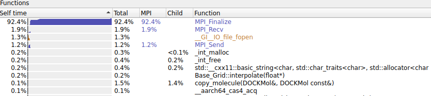
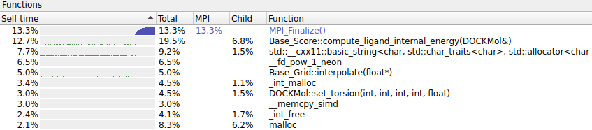

# DOCK 

**Description:** DOCK is a molecular docking program used in drug discovery. This program, given a protein binding site and a small molecule, tries to predict the correct binding mode of the small molecule in the binding site, and the associated binding energy.

**URL:** http://dock.compbio.ucsf.edu/DOCK_6/index.htm

**Team:**  Wolfpack

## Compilation

### Spack Package Modification

Details of any changes to the Spack recipe used.

We add jemalloc as the optimization, and the corresponding variant to control the switch of it. We also add the support for arm and nvhpc compilers.

Git commit hash of checkout for pacakage:

https://github.com/spack/spack/pull/24933/commits/1c5fd8a20033a4d785f4ad8f0cf33160ef637790

Pull request for Spack recipe changes:

https://github.com/spack/spack/pull/24933


There are some compilation errors when we use gcc/arm/nvhpc to compile it on arm platform. For gcc compiler, because we use gcc@10.3.0, there is a type mismatch error in fortran code. We add `-fallow-argument-mismatch` to solve it. For arm/nvhpc compilers, there is a multiple definition error when compile mixed fortran and c code for unknown reason. To solve this problem, we use c/cxx compiler with the main fortran library to compile such code.


### Building DOCK

#### GCC 10.3.0

```
spack install -j 64 dock@6.9%gcc@10.3.0+mpi
```

```
$ spack spec -Il dock@6.9%gcc@10.3.0+mpi

[+]  rhq5sjm  dock@6.9%gcc@10.3.0~jemalloc+mpi arch=linux-amzn2-graviton2
[+]  qrvbayi      ^bison@3.7.6%gcc@10.3.0 arch=linux-amzn2-graviton2
[+]  2w7bert          ^diffutils@3.7%gcc@10.3.0 arch=linux-amzn2-graviton2
[+]  y5ei3cm              ^libiconv@1.16%gcc@10.3.0 arch=linux-amzn2-graviton2
[+]  ebhjpix          ^m4@1.4.18%gcc@10.3.0+sigsegv patches=3877ab548f88597ab2327a2230ee048d2d07ace1062efe81fc92e91b7f39cd00,fc9b61654a3ba1a8d6cd78ce087e7c96366c290bc8d2c299f09828d793b853c8 arch=linux-amzn2-graviton2
[+]  ltbv6bk              ^libsigsegv@2.13%gcc@10.3.0 arch=linux-amzn2-graviton2
[+]  4m7exgb          ^perl@5.32.1%gcc@10.3.0+cpanm+shared+threads arch=linux-amzn2-graviton2
[+]  y42m6yr              ^berkeley-db@18.1.40%gcc@10.3.0+cxx~docs+stl patches=b231fcc4d5cff05e5c3a4814f6a5af0e9a966428dc2176540d2c05aff41de522 arch=linux-amzn2-graviton2
[+]  rqrpmap              ^bzip2@1.0.8%gcc@10.3.0~debug~pic+shared arch=linux-amzn2-graviton2
[+]  wjwqncx              ^gdbm@1.19%gcc@10.3.0 arch=linux-amzn2-graviton2
[+]  3zy7kxk                  ^readline@8.1%gcc@10.3.0 arch=linux-amzn2-graviton2
[+]  iwzirqc                      ^ncurses@6.2%gcc@10.3.0~symlinks+termlib abi=none arch=linux-amzn2-graviton2
[+]  s4pw7zm                          ^pkgconf@1.7.4%gcc@10.3.0 arch=linux-amzn2-graviton2
[+]  qepjcvj              ^zlib@1.2.11%gcc@10.3.0+optimize+pic+shared arch=linux-amzn2-graviton2
[+]  zvamksn      ^openmpi@4.1.0%gcc@10.3.0~atomics~cuda~cxx~cxx_exceptions+gpfs~internal-hwloc~java~legacylaunchers~lustre~memchecker+pmi~singularity~sqlite3+static~thread_multiple+vt+wrapper-rpath fabrics=ofi patches=60ce20bc14d98c572ef7883b9fcd254c3f232c2f3a13377480f96466169ac4c8 schedulers=slurm arch=linux-amzn2-graviton2
[+]  cukmqbg          ^hwloc@2.5.0%gcc@10.3.0~cairo~cuda~gl~libudev+libxml2~netloc~nvml+pci+shared arch=linux-amzn2-graviton2
[+]  asgtk6a              ^libpciaccess@0.16%gcc@10.3.0 arch=linux-amzn2-graviton2
[+]  z2uysov                  ^libtool@2.4.6%gcc@10.3.0 arch=linux-amzn2-graviton2
[+]  4xr3hhh                  ^util-macros@1.19.3%gcc@10.3.0 arch=linux-amzn2-graviton2
[+]  iyhm3wi              ^libxml2@2.9.10%gcc@10.3.0~python arch=linux-amzn2-graviton2
[+]  ye3kcvv                  ^xz@5.2.5%gcc@10.3.0~pic libs=shared,static arch=linux-amzn2-graviton2
[+]  tadxrfp          ^libevent@2.1.12%gcc@10.3.0+openssl arch=linux-amzn2-graviton2
[+]  5i3lgfb              ^openssl@1.1.1k%gcc@10.3.0~docs+systemcerts arch=linux-amzn2-graviton2
[+]  72f5gvk          ^libfabric@1.11.1-aws%gcc@10.3.0~debug~kdreg fabrics=sockets,tcp,udp arch=linux-amzn2-graviton2
[+]  mhav5gn          ^numactl@2.0.14%gcc@10.3.0 patches=4e1d78cbbb85de625bad28705e748856033eaafab92a66dffd383a3d7e00cc94,62fc8a8bf7665a60e8f4c93ebbd535647cebf74198f7afafec4c085a8825c006 arch=linux-amzn2-graviton2
[+]  jkuhz64              ^autoconf@2.69%gcc@10.3.0 arch=linux-amzn2-graviton2
[+]  xb2w5nc              ^automake@1.16.3%gcc@10.3.0 arch=linux-amzn2-graviton2
[+]  wturp6c          ^openssh@8.5p1%gcc@10.3.0 arch=linux-amzn2-graviton2
[+]  ivotdt7              ^libedit@3.1-20210216%gcc@10.3.0 arch=linux-amzn2-graviton2
[+]  wqpuvmh          ^slurm@20-02-4-1%gcc@10.3.0~gtk~hdf5~hwloc~mariadb~pmix+readline~restd sysconfdir=PREFIX/etc arch=linux-amzn2-graviton2
```

#### ARM 21.0.0.879

```
spack install -j 64 dock@6.9%arm@21.0.0.879+mpi
```

```
$ spack spec -Il dock@6.9%arm@21.0.0.879+mpi

 -   bipucy2  dock@6.9%arm@21.0.0.879~jemalloc+mpi arch=linux-amzn2-graviton2
[+]  cesxoxd      ^bison@3.7.6%arm@21.0.0.879 arch=linux-amzn2-graviton2
[+]  qchmimy          ^diffutils@3.7%arm@21.0.0.879 arch=linux-amzn2-graviton2
[+]  4fpawwk              ^libiconv@1.16%arm@21.0.0.879 arch=linux-amzn2-graviton2
[+]  guhrr3n          ^m4@1.4.18%arm@21.0.0.879+sigsegv patches=3877ab548f88597ab2327a2230ee048d2d07ace1062efe81fc92e91b7f39cd00,fc9b61654a3ba1a8d6cd78ce087e7c96366c290bc8d2c299f09828d793b853c8 arch=linux-amzn2-graviton2
[+]  q27ybb5              ^libsigsegv@2.13%arm@21.0.0.879 arch=linux-amzn2-graviton2
[+]  aoyzxyq          ^perl@5.32.1%arm@21.0.0.879+cpanm+shared+threads arch=linux-amzn2-graviton2
[+]  rd3hv7n              ^berkeley-db@18.1.40%arm@21.0.0.879+cxx~docs+stl patches=b231fcc4d5cff05e5c3a4814f6a5af0e9a966428dc2176540d2c05aff41de522 arch=linux-amzn2-graviton2
[+]  qaavobd              ^bzip2@1.0.8%arm@21.0.0.879~debug~pic+shared arch=linux-amzn2-graviton2
[+]  jbenr5m              ^gdbm@1.19%arm@21.0.0.879 arch=linux-amzn2-graviton2
[+]  7fjq32x                  ^readline@8.1%arm@21.0.0.879 arch=linux-amzn2-graviton2
[+]  5fshnbc                      ^ncurses@6.2%arm@21.0.0.879~symlinks+termlib abi=none arch=linux-amzn2-graviton2
[+]  s6jl232                          ^pkgconf@1.7.4%arm@21.0.0.879 arch=linux-amzn2-graviton2
[+]  kfhtmo3              ^zlib@1.2.11%arm@21.0.0.879+optimize+pic+shared arch=linux-amzn2-graviton2
[+]  huifkle      ^openmpi@4.1.0%arm@21.0.0.879~atomics~cuda~cxx~cxx_exceptions+gpfs~internal-hwloc~java~legacylaunchers~lustre~memchecker+pmi~singularity~sqlite3+static~thread_multiple+vt+wrapper-rpath fabrics=ofi patches=60ce20bc14d98c572ef7883b9fcd254c3f232c2f3a13377480f96466169ac4c8 schedulers=slurm arch=linux-amzn2-graviton2
[+]  xsh5tug          ^hwloc@2.5.0%arm@21.0.0.879~cairo~cuda~gl~libudev+libxml2~netloc~nvml+pci+shared arch=linux-amzn2-graviton2
[+]  heo5xlh              ^libpciaccess@0.16%arm@21.0.0.879 arch=linux-amzn2-graviton2
[+]  xcqslvj                  ^libtool@2.4.6%arm@21.0.0.879 arch=linux-amzn2-graviton2
[+]  6eey55q                  ^util-macros@1.19.3%arm@21.0.0.879 arch=linux-amzn2-graviton2
[+]  7og6524              ^libxml2@2.9.10%arm@21.0.0.879~python arch=linux-amzn2-graviton2
[+]  3uhexv5                  ^xz@5.2.5%arm@21.0.0.879~pic libs=shared,static arch=linux-amzn2-graviton2
[+]  hj5l7x5          ^libevent@2.1.12%arm@21.0.0.879+openssl arch=linux-amzn2-graviton2
[+]  b6rhpqo              ^openssl@1.1.1k%arm@21.0.0.879~docs+systemcerts arch=linux-amzn2-graviton2
[+]  v75lszn          ^libfabric@1.11.1-aws%arm@21.0.0.879~debug~kdreg fabrics=sockets,tcp,udp arch=linux-amzn2-graviton2
[+]  325gh7i          ^numactl@2.0.14%arm@21.0.0.879 patches=4e1d78cbbb85de625bad28705e748856033eaafab92a66dffd383a3d7e00cc94,62fc8a8bf7665a60e8f4c93ebbd535647cebf74198f7afafec4c085a8825c006 arch=linux-amzn2-graviton2
[+]  mbkv7qv              ^autoconf@2.69%arm@21.0.0.879 arch=linux-amzn2-graviton2
[+]  toijtok              ^automake@1.16.3%arm@21.0.0.879 arch=linux-amzn2-graviton2
[+]  7cmi2lb          ^openssh@8.5p1%arm@21.0.0.879 arch=linux-amzn2-graviton2
[+]  qytqrqe              ^libedit@3.1-20210216%arm@21.0.0.879 arch=linux-amzn2-graviton2
[+]  uxllonc          ^slurm@20-02-4-1%arm@21.0.0.879~gtk~hdf5~hwloc~mariadb~pmix+readline~restd sysconfdir=PREFIX/etc arch=linux-amzn2-graviton2
```

#### NVHPC 21.2

```
spack install -j 64 dock@6.9%nvhpc@21.2+mpi
```

```
$ spack spec -Il dock@6.9%nvhpc@21.2+mpi

 -   2ny2s4c  dock@6.9%nvhpc@21.2~jemalloc+mpi arch=linux-amzn2-graviton2
[+]  n5wqmqc      ^bison@3.7.6%nvhpc@21.2 patches=5e354803e20a72f930f69acf7e1c7418e09029036dab8fd42e78b8ed13b9a0e7 arch=linux-amzn2-graviton2
[+]  s4mb5no          ^diffutils@3.7%nvhpc@21.2 patches=6e42dc243f17aab29fd167f060f5bc1f08813e03368eb301b43c95d4b1386681 arch=linux-amzn2-graviton2
[+]  r7mmkdp              ^libiconv@1.16%nvhpc@21.2 arch=linux-amzn2-graviton2
[+]  6c4kz5g          ^m4@1.4.18%nvhpc@21.2+sigsegv patches=3877ab548f88597ab2327a2230ee048d2d07ace1062efe81fc92e91b7f39cd00,5746cf51f45b405661c3edae7a78c33d41e54d83f635d16e2bf1f956dbfbf635,fc9b61654a3ba1a8d6cd78ce087e7c96366c290bc8d2c299f09828d793b853c8 arch=linux-amzn2-graviton2
[+]  pa6wm5j              ^libsigsegv@2.13%nvhpc@21.2 arch=linux-amzn2-graviton2
[+]  gn4fgp5          ^perl@5.32.1%nvhpc@21.2+cpanm+shared+threads patches=21cf6a73cec16760f8de2e8895ace1299aff2d8e92dc581cd18f1d95a4503048 arch=linux-amzn2-graviton2
[+]  5uyf3k4              ^berkeley-db@18.1.40%nvhpc@21.2+cxx~docs+stl patches=b231fcc4d5cff05e5c3a4814f6a5af0e9a966428dc2176540d2c05aff41de522 arch=linux-amzn2-graviton2
[+]  wsi7g3j              ^bzip2@1.0.8%nvhpc@21.2~debug~pic+shared arch=linux-amzn2-graviton2
[+]  m2wdbeo              ^gdbm@1.19%nvhpc@21.2 arch=linux-amzn2-graviton2
[+]  zori3wf                  ^readline@8.1%nvhpc@21.2 arch=linux-amzn2-graviton2
[+]  asgm7mt                      ^ncurses@6.2%nvhpc@21.2~symlinks+termlib abi=none arch=linux-amzn2-graviton2
[+]  vtiml6g                          ^pkgconf@1.7.4%nvhpc@21.2 arch=linux-amzn2-graviton2
[+]  4js6ect              ^zlib@1.2.11%nvhpc@21.2+optimize+pic+shared arch=linux-amzn2-graviton2
[+]  krxyvbc      ^openmpi@4.1.0%nvhpc@21.2~atomics~cuda~cxx~cxx_exceptions+gpfs~internal-hwloc~java~legacylaunchers~lustre~memchecker+pmi~singularity~sqlite3+static~thread_multiple+vt+wrapper-rpath fabrics=ofi patches=60ce20bc14d98c572ef7883b9fcd254c3f232c2f3a13377480f96466169ac4c8,fba0d3a784a9723338722b48024a22bb32f6a951db841a4e9f08930a93f41d7a schedulers=slurm arch=linux-amzn2-graviton2
[+]  jroqews          ^hwloc@2.5.0%nvhpc@21.2~cairo~cuda~gl~libudev+libxml2~netloc~nvml+pci+shared arch=linux-amzn2-graviton2
[+]  e4m4ued              ^libpciaccess@0.16%nvhpc@21.2 patches=6e08dc445ece06e9e8b1344397f2d3f169005703ddc0f2ae24f366cde78c7377 arch=linux-amzn2-graviton2
[+]  kk4ax3i                  ^libtool@2.4.6%nvhpc@21.2 arch=linux-amzn2-graviton2
[+]  4imdwuy                  ^util-macros@1.19.3%nvhpc@21.2 arch=linux-amzn2-graviton2
[+]  wo4l72s              ^libxml2@2.9.10%nvhpc@21.2~python patches=05ff238cf435825ef835c7ae39376b52dc83d8caf19e962f0766c841386a305a,10a88ad47f9797cf7cf2d7d07241f665a3b6d1f31fa026728c8c2ae93e1664e9 arch=linux-amzn2-graviton2
[+]  br733tn                  ^xz@5.2.5%nvhpc@21.2~pic libs=shared,static arch=linux-amzn2-graviton2
[+]  uttaumr          ^libevent@2.1.12%nvhpc@21.2+openssl arch=linux-amzn2-graviton2
[+]  j2qhi7h              ^openssl@1.1.1k%nvhpc@21.2~docs+systemcerts arch=linux-amzn2-graviton2
[+]  xl6zavq          ^libfabric@1.11.1-aws%nvhpc@21.2~debug~kdreg fabrics=sockets,tcp,udp arch=linux-amzn2-graviton2
[+]  5yq4tpw          ^numactl@2.0.14%nvhpc@21.2 patches=4e1d78cbbb85de625bad28705e748856033eaafab92a66dffd383a3d7e00cc94,62fc8a8bf7665a60e8f4c93ebbd535647cebf74198f7afafec4c085a8825c006 arch=linux-amzn2-graviton2
[+]  fo57byt              ^autoconf@2.69%nvhpc@21.2 arch=linux-amzn2-graviton2
[+]  gmd4264              ^automake@1.16.3%nvhpc@21.2 arch=linux-amzn2-graviton2
[+]  cl3ohqo          ^openssh@8.5p1%nvhpc@21.2 arch=linux-amzn2-graviton2
[+]  yvqpq74              ^libedit@3.1-20210216%nvhpc@21.2 arch=linux-amzn2-graviton2
[+]  zehhooy          ^slurm@20-02-4-1%nvhpc@21.2~gtk~hdf5~hwloc~mariadb~pmix+readline~restd sysconfdir=PREFIX/etc arch=linux-amzn2-graviton2
```

## Test Case 1

[ReFrame Benchmark 1](#)

```
../bin/reframe -c benchmark.py -r --performance-report
```

### Validation

Details of the validation for `Test Case 1`.


### ReFrame Output

```
==============================================================================
PERFORMANCE REPORT
------------------------------------------------------------------------------
     **** 
------------------------------------------------------------------------------
```

### On-node Compiler Comparison

Performance comparison of two compilers.

| Cores | Compiler 1 | Compiler 2 |
|-------|------------|------------|
|       |            |            |


### Serial Hot-spot Profile

List of top-10 functions / code locations from a serial profile.

#### Test Case 1
Profiling script:
[ReFrame Benchmark](reframe_scripts/dock_profiles_test1.py)


#### Test Case 2
Profiling script:
[ReFrame Benchmark](reframe_scripts/dock_profiles_test2.py)


#### Test Case 3
Profiling script:
[ReFrame Benchmark](reframe_scripts/dock_profiles_test3.py)


#### Test Case 4
Profiling script:
[ReFrame Benchmark](reframe_scripts/dock_profiles_test4.py)  
  

### Full Node Hot-spot Profile

List of top-10 functions / code locations from a full node profile.

#### arm
#### Test Case 1
Profiling script:
[ReFrame Benchmark](reframe_scripts/dock_profilef_test1_arm.py)


#### Test Case 2
Profiling script:
[ReFrame Benchmark](reframe_scripts/dock_profilef_test2_arm.py)


#### Test Case 3
Profiling script:
[ReFrame Benchmark](reframe_scripts/dock_profilef_test3_arm.py)


#### Test Case 4
Profiling script:
[ReFrame Benchmark](reframe_scripts/dock_profilef_test4_arm.py)


#### gcc
#### Test Case 1
Profiling script:
[ReFrame Benchmark](reframe_scripts/dock_profilef_test1_gcc.py)


#### Test Case 2
Profiling script:
[ReFrame Benchmark](reframe_scripts/dock_profilef_test2_gcc.py)


#### Test Case 3
Profiling script:
[ReFrame Benchmark](reframe_scripts/dock_profilef_test3_gcc.py)


#### Test Case 4
Profiling script:
[ReFrame Benchmark](reframe_scripts/dock_profilef_test4_gcc.py)


#### nvhpc
#### Test Case 1
Profiling script:
[ReFrame Benchmark](reframe_scripts/dock_profilef_test1_nv.py)


#### Test Case 2
Profiling script:
[ReFrame Benchmark](reframe_scripts/dock_profilef_test2_nv.py)


#### Test Case 3
Profiling script:
[ReFrame Benchmark](reframe_scripts/dock_profilef_test3_nv.py)


#### Test Case 4
Profiling script:
[ReFrame Benchmark](reframe_scripts/dock_profilef_test4_nv.py)



### Strong Scaling Study

On-node scaling study for two compilers.
#### Test Case 1
| Cores | gcc | arm | nvhpc |
|-------|------------|------------|------------|
| 8     | 5.4 s          | 4.76 s           | 5.23 s |
| 16    | 4.23 s           | 4.21 s           | 5.31 s |
| 32    | 4.69 s           | 4.68 s           | 5.2 s |
| 64    | 5.72 s           | 5.73 s           | 6.22 s |

#### Test Case 2
| Cores | gcc | arm | nvhpc |
|-------|------------|------------|------------|
| 8     | 380.47 s           | 379.55 s            | 452.45 s |
| 16    | 180.85 s           | 180.51 s           | 215.18 s |
| 32    | 91.7 s           | 92.02 s           | 108.98 s |
| 64    | 49.32 s           | 49.34 s           | 57.51 s |

#### Test Case 3
| Cores | gcc | arm | nvhpc |
|-------|------------|------------|------------|
| 8     | 147.27 s           | 149.21 s           | 176.54 s |
| 16    | 72.2 s           | 72.8 s           | 86.12 s |
| 32    | 38.57 s           | 38.68 s           | 47.17 s |
| 64    | 24.9 s           | 24.65 s           | 29.07 s |

#### Test Case 4
| Cores | gcc | arm | nvhpc |
|-------|------------|------------|------------|
| 8     | 624.82 s           | 640.2 s           | 774.42 s |
| 16    | 298.95 s           | 306.58 s           | 367.14 s |
| 32    | 149.42 s           | 152.75 s           | 184.17 s |
| 64    | 84.8 s           | 87.79 s           | 104.57 s |


### Off-Node Scaling Study

#### Test Case 1
| Nodes | Cores | arm | gcc | nvhpc|
|-------|-------|-----|------|------|
| 1     | 32    | 149.42 s    | 152.75  s    | 184.17 s     |
| 1     | 64    | 84.8 s    | 87.79 s     | 184.17 s     |
| 2     | 128   | 5.42 s    | 5.17 s     | 6.0 s     |
| 4     | 256   | 242.98 s    | 243.27 s     | 122.88 s     |

#### Test Case 2


| Nodes | Cores | arm | gcc | nvhpc|
|-------|-------|-----|------|------|
| 1     | 32    | 91.7 s   | 92.02     | 108.98     |
| 1     | 64    | 49.32 s    | 49.34     | 57.51     |
| 2     | 128   | 46.72 s    | 47.87 s     | 54.99 s     |
| 4     | 256   | 285.34 s    | 165.37 s     | 53.39 s     |


#### Test Case 3

| Nodes | Cores | arm | gcc | nvhpc|
|-------|-------|-----|------|------|
| 1     | 32    | 38.57 s    | 38.68     | 47.17     |
| 1     | 64    | 24.9 s    | 24.65     | 29.07     |
| 2     | 128   | 23.07 s    | 263.83 s    |27.43 s      |
| 4     | 256   | 259.71 s    | 262.33 s     | 26.78 s     |

#### Test Case 4
| Nodes | Cores | arm | gcc | nvhpc|
|-------|-------|-----|------|------|
| 1     | 32    | 149.42 s    | 152.75     | 184.17     |
| 1     | 64    | 84.8 s    | 87.79     | 104.57     |
| 2     | 128   | 84.11 s    | 190.17 s     | 209.04 s     |
| 4     | 256   | 310.51 s    | 207.26 s     | 101.01 s     |


### On-Node Architecture Comparison

On-node scaling study for two architectures.
#### Test Case 1
| Cores | ARM(gcc) | X86(gcc) | X86(nvhpc)               |
|-------|----------------|-----------|-----------|
| 8     | 5.4 s               | 5.09 s          | 4.93 s               |                
| 16    | 4.23 s               | 3.81 s          | 4.21 s                |               
| 32    | 4.69 s               | 4.32 s          | 6.15 s                 |              
| 64    | 5.72 s               | 6.79 s          |                  |              

#### Test Case 2
| Cores | ARM(gcc) | X86 |X86(nvhpc)               |
|-------|----------------|-----------|-----------|
| 8     | 380.47 s               | 493.54 s          | 601.18 s               |
| 16    | 180.85 s               | 237.41 s          | 285.5 s               |
| 32    | 91.7 s               | 119.79 s          | 142.48 s               |
| 64    | 49.32 s               | 62.11 s          |                |

#### Test Case 3
| Cores | ARM(gcc) | X86 |X86(nvhpc)               |
|-------|----------------|-----------|-----------|
| 8     | 147.27 s               | 189.52 s          | 232.3 s               |
| 16    | 72.2 s               | 93.0 s          |  113.59 s              |
| 32    | 38.57 s               | 47.77 s          | 57.94 s               |
| 64    | 24.9 s               | 28.26 s          |                |

#### Test Case 4
| Cores | ARM(gcc) | X86 |X86(nvhpc)               |
|-------|----------------|-----------|-----------|
| 8     |  624.82 s              | 814.98 s          | 1027.04 s               |
| 16    |  298.95 s              | 385.96 s          | 485.81 s               |
| 32    |  149.42 s              | 192.27 s          |                |
| 64    |  84.8 s              | 104.91 s          |                |

### Off-Node Architecture Comparison

#### Test Case 1
| Nodes | Cores | ARM(gcc)           | X86(gcc)    | X86(nvhpc)               |
|-------|-------|----------------|-----------|-----------|
| 1     | 32     |  4.69 s              | 4.32 s          |                |                
| 1     | 64    |   5.72 s             |  6.79 s         |                 |               
| 2     | 128    | 5.42 s               | 5.72 s          |                  |              
| 4     | 256    | 242.98 s              | 5.29 s          |                  |     

#### Test Case 2
| Nodes | Cores | ARM(gcc)            | X86(gcc)    | X86(nvhpc)               |
|-------|-------|----------------|-----------|-----------|
| 1     | 32     |  380.47 s              | 493.54 s          |                |                
| 1     | 64    |  180.85 s              | 237.41 s          |                 |               
| 2     | 128    |   46.72 s             | 60.91 s          |                  |              
| 4     | 256    |   285.34 s             | 59.27 s          |                  |     

#### Test Case 3
| Nodes | Cores | ARM(gcc)            | X86(gcc)    | X86(nvhpc)               |
|-------|-------|----------------|-----------|-----------|
| 1     | 32     |  147.27 s              |  189.52 s         |                |                
| 1     | 64    |   72.2 s             |  93.0 s         |                 |               
| 2     | 128    |    23.07 s            | 26.13 s          |                  |              
| 4     | 256    |    259.71 s            | 26.26 s          |                  |     

#### Test Case 4
| Nodes | Cores | ARM(gcc)            | X86(gcc)    | X86(nvhpc)               |
|-------|-------|----------------|-----------|-----------|
| 1     | 32     |   624.82 s             |  814.98 s         |                |                
| 1     | 64    |   298.95 s             |  385.96 s         |                 |               
| 2     | 128    |    84.11 s            | 101.48 s          |                  |              
| 4     | 256    |    310.51 s            | 101.6 s          |                  |     

## Optimisation

Details of steps taken to optimise performance of the application.
Please document work with compiler flags, maths libraries, system libraries, code optimisations, etc.

### Compiler Flag Tuning

Compiler flags before:
```
CFLAGS=-DBUILD_DOCK_WITH_MPI -DMPICH_IGNORE_CXX_SEEK -DMPICH_SKIP_MPICXX -I$(MPICH_HOME)/include -O2 
FFLAGS=-O2 -fno-automatic -fno-second-underscore -fallow-argument-mismatch 
```

Compiler flags after:
```
CFLAGS=-DBUILD_DOCK_WITH_MPI -DMPICH_IGNORE_CXX_SEEK -DMPICH_SKIP_MPICXX -I$(MPICH_HOME)/include -O2 -Ofast
FFLAGS=-O2 -fno-automatic -fno-second-underscore -fallow-argument-mismatch -Ofast
```

#### Compiler Flag Performance

The following table is based on gcc@10.3.0 with test case 4.

| Cores | Original Flags | New Flags | Speedup |
| ----- | -------------- | --------- | ------- |
| 8     | 624.82         | 634.28    | 0.99    |
| 16    | 298.95         | 303.3     | 0.99    |
| 32    | 149.42         | 151.57    | 0.99    |
| 64    | 84.8           | 84.51     | 1.00    |

### Performance Regression

How fast can you make the code?

Use all of the above aproaches and any others to make the code as fast as possible.
Demonstrate your gains by providing a scaling study for your test case, demonstrating the performance before and after.

The following table is based on gcc@10.3.0 with test case 4. The speedup is up to 1.18X. The percentage of reduction runtime is up to **15.33%**.

| Cores | gcc    | Optimization | Speedup |
| ----- | ------ | ------------ | ------- |
| 8     | 624.82 | 529.05       | 1.18    |
| 16    | 298.95 | 254.74       | 1.17    |
| 32    | 149.42 | 126.82       | 1.18    |
| 64    | 84.8   | 72.32        | 1.17    |

#### Code modifications

We add the arm/nvhpc compilers support following their coding rules. The [attached files](config_files/) are those configuration files. We use `jemalloc` to replace the original system malloc library by installing `jemalloc` and adding `-ljemalloc` to the configuration files.

#### Compiler flags

The `-ljemalloc` in configuration files will be passed as compilation flags.

#### Spack recipe and build line

Our [spack recipe](package.py) is attached.

#### ReFrame script

Our [reframe script](reframe_scripts/dock_opt_gcc.py) for optimization is attached.

## Report

### Compilation Summary

DOCK suite includes four applications. Except the application dock, the other three are run sequentially. The application dock, written in the mix of C, C++, and Fortran, runs with MPI. Building dock is straightforward with GCC compiler. However, it incurs compilation errors with ARM21 and nvhpc “main function is redefined”. We figured out that the main function is in C++ code but the linker is using fortran compiler (armflang). Thus, we change the linker with the C++ compiler (armclang++) and link the fortran library. With this modification, dock is
successfully compiled with all gcc, arm21, and nvhpc compilers.

### Performance Summary

From our experiments, we find that arm21 and gcc10 compilers yield comparable performance. For the on-node scaling study, arm21 and gcc10 a
re generally better than nvhpc, while for the off-node scaling study, arm21 and gcc10 perform worse than nvhpc. We also find that the on-no
de scaling is generally good for all compilers. However, the off-node scaling is not good. One potential reason is that the input workload provided by the application is not large enough to be divided across nodes.


### Optimisation Summary

We have tested compiler option tuning, e.g., -Ofast. Unfortunately, we do not get any speedups. With the profile, we find that many cpu cyc
les are consumed in malloc and free functions. Thus, we have jemalloc linked with the application, which yield a maxmum 14% speedup when us
ing gcc10 running with 8 cores.
