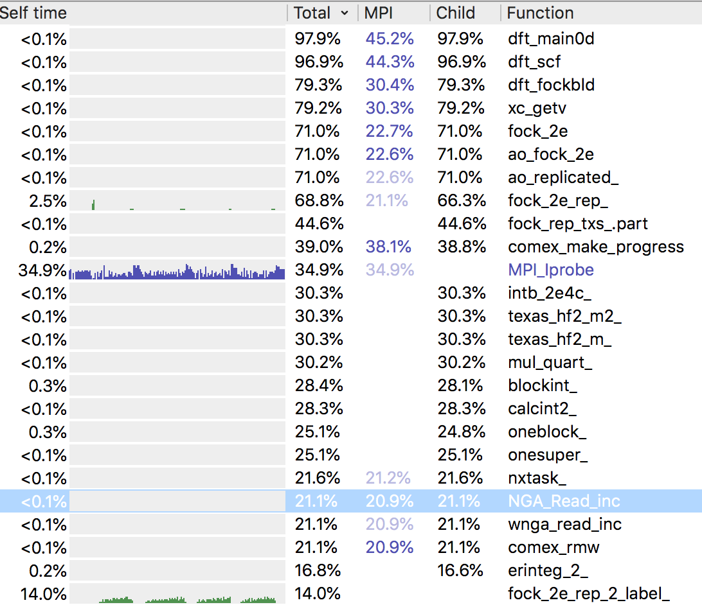
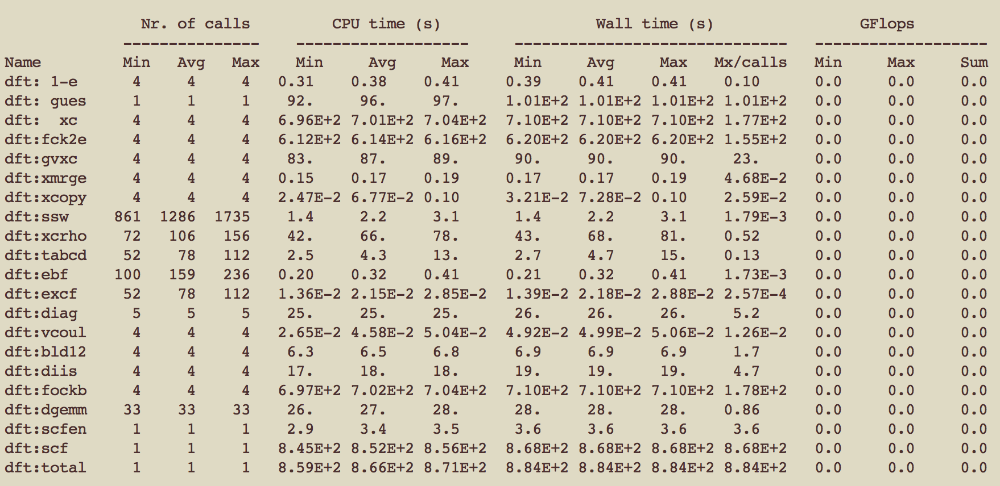
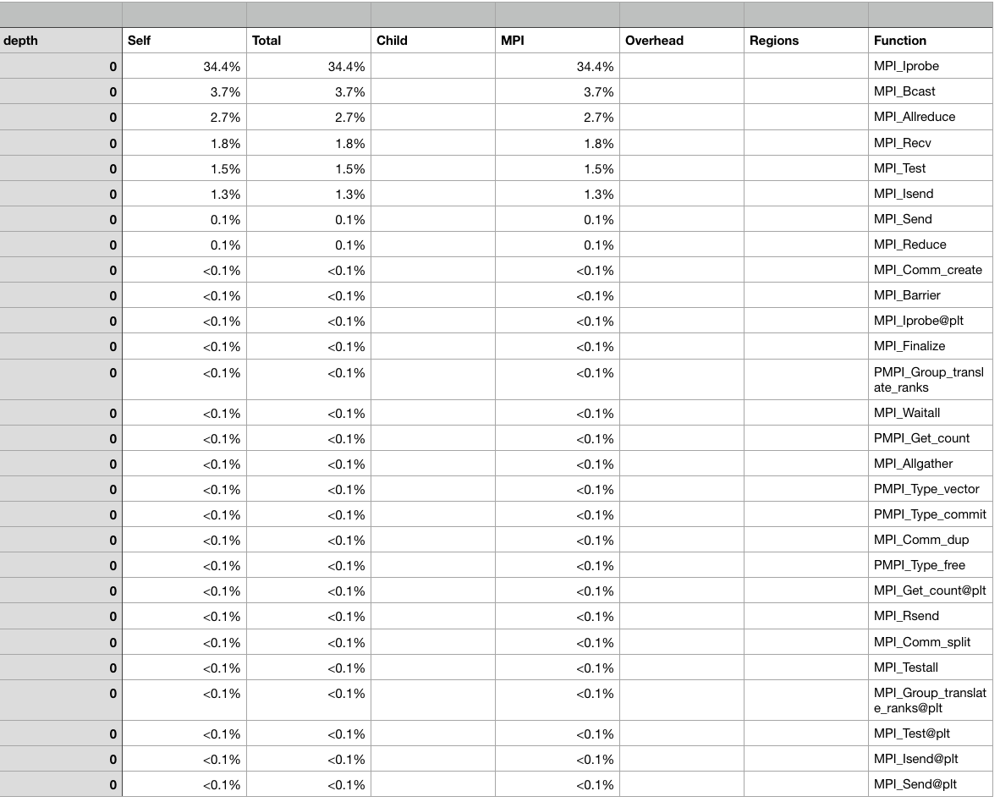

# NWChem 

**Description:** High-performance computational chemistry software

**URL:** https://nwchemgit.github.io

**Team:** QMLab 

## Compilation

### Spack Package Modification

Details of any changes to the Spack recipe used.
 - No change required   
Git commit hash of checkout for pacakage:
```bash
spack :
commit 667ab501996058b1f89f1763d1791befa455b1f8
```
Pull request for Spack recipe changes:

### Building NWChem


#### Compiler 1

```
spack install nwchem@7.0.2%gcc@10.3.0 ^armpl@21.0.0 ^openmpi
```

```
$spack spec -Il nwchem@7.0.2%gcc@10.3.0 ^armpl@21.0.0 ^openmpi
Input spec
--------------------------------
 -   nwchem@7.0.2%gcc@10.3.0
 -       ^armpl@21.0.0
 -       ^openmpi

Concretized
--------------------------------
[+]  by6xpd3  nwchem@7.0.2%gcc@10.3.0 arch=linux-amzn2-graviton2
[+]  eq5pyyv      ^armpl@21.0.0%gcc@10.3.0~ilp64+shared~sve threads=none arch=linux-amzn2-graviton2
[+]  vcj72yk          ^acfl@21.0%gcc@10.3.0 arch=linux-amzn2-graviton2
[+]  atkhmqf      ^netlib-scalapack@2.1.0%gcc@10.3.0~ipo~pic+shared build_type=Release patches=1c9ce5fee1451a08c2de3cc87f446aeda0b818ebbce4ad0d980ddf2f2a0b2dc4,f2baedde688ffe4c20943c334f580eb298e04d6f35c86b90a1f4e8cb7ae344a2 arch=linux-amzn2-graviton2
[+]  m7325ee          ^cmake@3.20.5%gcc@10.3.0~doc+ncurses+openssl+ownlibs~qt build_type=Release arch=linux-amzn2-graviton2
[+]  iwzirqc              ^ncurses@6.2%gcc@10.3.0~symlinks+termlib abi=none arch=linux-amzn2-graviton2
[+]  s4pw7zm                  ^pkgconf@1.7.4%gcc@10.3.0 arch=linux-amzn2-graviton2
[+]  5i3lgfb              ^openssl@1.1.1k%gcc@10.3.0~docs+systemcerts arch=linux-amzn2-graviton2
[+]  4m7exgb                  ^perl@5.32.1%gcc@10.3.0+cpanm+shared+threads arch=linux-amzn2-graviton2
[+]  y42m6yr                      ^berkeley-db@18.1.40%gcc@10.3.0+cxx~docs+stl patches=b231fcc4d5cff05e5c3a4814f6a5af0e9a966428dc2176540d2c05aff41de522 arch=linux-amzn2-graviton2
[+]  rqrpmap                      ^bzip2@1.0.8%gcc@10.3.0~debug~pic+shared arch=linux-amzn2-graviton2
[+]  2w7bert                          ^diffutils@3.7%gcc@10.3.0 arch=linux-amzn2-graviton2
[+]  y5ei3cm                              ^libiconv@1.16%gcc@10.3.0 arch=linux-amzn2-graviton2
[+]  wjwqncx                      ^gdbm@1.19%gcc@10.3.0 arch=linux-amzn2-graviton2
[+]  3zy7kxk                          ^readline@8.1%gcc@10.3.0 arch=linux-amzn2-graviton2
[+]  qepjcvj                      ^zlib@1.2.11%gcc@10.3.0+optimize+pic+shared arch=linux-amzn2-graviton2
[+]  zvamksn          ^openmpi@4.1.0%gcc@10.3.0~atomics~cuda~cxx~cxx_exceptions+gpfs~internal-hwloc~java~legacylaunchers~lustre~memchecker+pmi~singularity~sqlite3+static~thread_multiple+vt+wrapper-rpath fabrics=ofi patches=60ce20bc14d98c572ef7883b9fcd254c3f232c2f3a13377480f96466169ac4c8 schedulers=slurm arch=linux-amzn2-graviton2
[+]  cukmqbg              ^hwloc@2.5.0%gcc@10.3.0~cairo~cuda~gl~libudev+libxml2~netloc~nvml+pci+shared arch=linux-amzn2-graviton2
[+]  asgtk6a                  ^libpciaccess@0.16%gcc@10.3.0 arch=linux-amzn2-graviton2
[+]  z2uysov                      ^libtool@2.4.6%gcc@10.3.0 arch=linux-amzn2-graviton2
[+]  ebhjpix                          ^m4@1.4.18%gcc@10.3.0+sigsegv patches=3877ab548f88597ab2327a2230ee048d2d07ace1062efe81fc92e91b7f39cd00,fc9b61654a3ba1a8d6cd78ce087e7c96366c290bc8d2c299f09828d793b853c8 arch=linux-amzn2-graviton2
[+]  ltbv6bk                              ^libsigsegv@2.13%gcc@10.3.0 arch=linux-amzn2-graviton2
[+]  4xr3hhh                      ^util-macros@1.19.3%gcc@10.3.0 arch=linux-amzn2-graviton2
[+]  iyhm3wi                  ^libxml2@2.9.10%gcc@10.3.0~python arch=linux-amzn2-graviton2
[+]  ye3kcvv                      ^xz@5.2.5%gcc@10.3.0~pic libs=shared,static arch=linux-amzn2-graviton2
[+]  tadxrfp              ^libevent@2.1.12%gcc@10.3.0+openssl arch=linux-amzn2-graviton2
[+]  72f5gvk              ^libfabric@1.11.1-aws%gcc@10.3.0~debug~kdreg fabrics=sockets,tcp,udp arch=linux-amzn2-graviton2
[+]  mhav5gn              ^numactl@2.0.14%gcc@10.3.0 patches=4e1d78cbbb85de625bad28705e748856033eaafab92a66dffd383a3d7e00cc94,62fc8a8bf7665a60e8f4c93ebbd535647cebf74198f7afafec4c085a8825c006 arch=linux-amzn2-graviton2
[+]  jkuhz64                  ^autoconf@2.69%gcc@10.3.0 arch=linux-amzn2-graviton2
[+]  xb2w5nc                  ^automake@1.16.3%gcc@10.3.0 arch=linux-amzn2-graviton2
[+]  wturp6c              ^openssh@8.5p1%gcc@10.3.0 arch=linux-amzn2-graviton2
[+]  ivotdt7                  ^libedit@3.1-20210216%gcc@10.3.0 arch=linux-amzn2-graviton2
[+]  wqpuvmh              ^slurm@20-02-4-1%gcc@10.3.0~gtk~hdf5~hwloc~mariadb~pmix+readline~restd sysconfdir=PREFIX/etc arch=linux-amzn2-graviton2
[+]  62czasr      ^python@3.8.11%gcc@10.3.0+bz2+ctypes+dbm~debug+libxml2+lzma~nis~optimizations+pic+pyexpat+pythoncmd+readline+shared+sqlite3+ssl~tix~tkinter~ucs4+uuid+zlib patches=0d98e93189bc278fbc37a50ed7f183bd8aaf249a8e1670a465f0db6bb4f8cf87 arch=linux-amzn2-graviton2
[+]  ychdz7l          ^expat@2.4.1%gcc@10.3.0+libbsd arch=linux-amzn2-graviton2
[+]  ourxkez              ^libbsd@0.11.3%gcc@10.3.0 arch=linux-amzn2-graviton2
[+]  nssrqfc                  ^libmd@1.0.3%gcc@10.3.0 arch=linux-amzn2-graviton2
[+]  fqlpcsl          ^gettext@0.21%gcc@10.3.0+bzip2+curses+git~libunistring+libxml2+tar+xz arch=linux-amzn2-graviton2
[+]  v6cutkh              ^tar@1.34%gcc@10.3.0 arch=linux-amzn2-graviton2
[+]  35cffos          ^libffi@3.3%gcc@10.3.0 patches=26f26c6f29a7ce9bf370ad3ab2610f99365b4bdd7b82e7c31df41a3370d685c0 arch=linux-amzn2-graviton2
[+]  2q753q6          ^sqlite@3.35.5%gcc@10.3.0+column_metadata+fts~functions~rtree arch=linux-amzn2-graviton2
[+]  2non7qx          ^util-linux-uuid@2.36.2%gcc@10.3.0 arch=linux-amzn2-graviton2
```
#### Compiler 2
```
spack install nwchem@7.0.2%%arm@21.0.0.879 ^armpl@21.0.0 ^openmpi
```

```
Input spec
--------------------------------
 -   nwchem@7.0.2%arm@21.0.0.879
 -       ^armpl@21.0.0
 -       ^openmpi

Concretized
--------------------------------
==> Warning: arm@21.0.0.879 cannot build optimized binaries for "graviton2". Using best target possible: "aarch64"
[+]  66ljtcr  nwchem@7.0.2%arm@21.0.0.879 arch=linux-amzn2-aarch64
[+]  jlr3hbf      ^armpl@21.0.0%arm@21.0.0.879~ilp64+shared~sve threads=none arch=linux-amzn2-aarch64
[+]  qxrgeml          ^acfl@21.0%arm@21.0.0.879 arch=linux-amzn2-aarch64
[+]  k4tkt3h      ^netlib-scalapack@2.1.0%arm@21.0.0.879~ipo~pic+shared build_type=Release patches=1c9ce5fee1451a08c2de3cc87f446aeda0b818ebbce4ad0d980ddf2f2a0b2dc4,f2baedde688ffe4c20943c334f580eb298e04d6f35c86b90a1f4e8cb7ae344a2 arch=linux-amzn2-aarch64
[+]  fqvybaf          ^cmake@3.20.5%arm@21.0.0.879~doc+ncurses+openssl+ownlibs~qt build_type=Release arch=linux-amzn2-aarch64
[+]  uhtqtlb              ^ncurses@6.2%arm@21.0.0.879~symlinks+termlib abi=none arch=linux-amzn2-aarch64
[+]  zpuzm23                  ^pkgconf@1.7.4%arm@21.0.0.879 arch=linux-amzn2-aarch64
[+]  vc3waha              ^openssl@1.1.1k%arm@21.0.0.879~docs+systemcerts arch=linux-amzn2-aarch64
[+]  vv6txro                  ^perl@5.32.1%arm@21.0.0.879+cpanm+shared+threads arch=linux-amzn2-aarch64
[+]  33wiajj                      ^berkeley-db@18.1.40%arm@21.0.0.879+cxx~docs+stl patches=b231fcc4d5cff05e5c3a4814f6a5af0e9a966428dc2176540d2c05aff41de522 arch=linux-amzn2-aarch64
[+]  z4ybgri                      ^bzip2@1.0.8%arm@21.0.0.879~debug~pic+shared arch=linux-amzn2-aarch64
[+]  adtc6yc                          ^diffutils@3.7%arm@21.0.0.879 arch=linux-amzn2-aarch64
[+]  7vnthzn                              ^libiconv@1.16%arm@21.0.0.879 arch=linux-amzn2-aarch64
[+]  645q4qj                      ^gdbm@1.19%arm@21.0.0.879 arch=linux-amzn2-aarch64
[+]  3haw5gt                          ^readline@8.1%arm@21.0.0.879 arch=linux-amzn2-aarch64
[+]  puuxvg2                      ^zlib@1.2.11%arm@21.0.0.879+optimize+pic+shared arch=linux-amzn2-aarch64
[+]  lmaoy5t          ^openmpi@4.1.0%arm@21.0.0.879~atomics~cuda~cxx~cxx_exceptions+gpfs~internal-hwloc~java~legacylaunchers~lustre~memchecker+pmi~singularity~sqlite3+static~thread_multiple+vt+wrapper-rpath fabrics=ofi patches=60ce20bc14d98c572ef7883b9fcd254c3f232c2f3a13377480f96466169ac4c8 schedulers=slurm arch=linux-amzn2-aarch64
[+]  xl6anaa              ^hwloc@2.5.0%arm@21.0.0.879~cairo~cuda~gl~libudev+libxml2~netloc~nvml+pci+shared arch=linux-amzn2-aarch64
[+]  jueqz7p                  ^libpciaccess@0.16%arm@21.0.0.879 arch=linux-amzn2-aarch64
[+]  e4ssqx6                      ^libtool@2.4.6%arm@21.0.0.879 arch=linux-amzn2-aarch64
[+]  i2jmeo4                          ^m4@1.4.18%arm@21.0.0.879+sigsegv patches=3877ab548f88597ab2327a2230ee048d2d07ace1062efe81fc92e91b7f39cd00,fc9b61654a3ba1a8d6cd78ce087e7c96366c290bc8d2c299f09828d793b853c8 arch=linux-amzn2-aarch64
[+]  6jhzlul                              ^libsigsegv@2.13%arm@21.0.0.879 arch=linux-amzn2-aarch64
[+]  uwcxkin                      ^util-macros@1.19.3%arm@21.0.0.879 arch=linux-amzn2-aarch64
[+]  dypqz2i                  ^libxml2@2.9.10%arm@21.0.0.879~python arch=linux-amzn2-aarch64
[+]  zqsab4f                      ^xz@5.2.5%arm@21.0.0.879~pic libs=shared,static arch=linux-amzn2-aarch64
[+]  gonqskn              ^libevent@2.1.12%arm@21.0.0.879+openssl arch=linux-amzn2-aarch64
[+]  qdn27nh              ^libfabric@1.11.1-aws%arm@21.0.0.879~debug~kdreg fabrics=sockets,tcp,udp arch=linux-amzn2-aarch64
[+]  mv2g7r5              ^numactl@2.0.14%arm@21.0.0.879 patches=4e1d78cbbb85de625bad28705e748856033eaafab92a66dffd383a3d7e00cc94,62fc8a8bf7665a60e8f4c93ebbd535647cebf74198f7afafec4c085a8825c006 arch=linux-amzn2-aarch64
[+]  dcs645r                  ^autoconf@2.69%arm@21.0.0.879 arch=linux-amzn2-aarch64
[+]  edezkz3                  ^automake@1.16.3%arm@21.0.0.879 arch=linux-amzn2-aarch64
[+]  6vvthuo              ^openssh@8.5p1%arm@21.0.0.879 arch=linux-amzn2-aarch64
[+]  xe4evc4                  ^libedit@3.1-20210216%arm@21.0.0.879 arch=linux-amzn2-aarch64
[+]  x5xehti              ^slurm@20-02-4-1%arm@21.0.0.879~gtk~hdf5~hwloc~mariadb~pmix+readline~restd sysconfdir=PREFIX/etc arch=linux-amzn2-aarch64
[+]  jk7wv5q      ^python@3.8.11%arm@21.0.0.879+bz2+ctypes+dbm~debug+libxml2+lzma~nis~optimizations+pic+pyexpat+pythoncmd+readline+shared+sqlite3+ssl~tix~tkinter~ucs4+uuid+zlib patches=0d98e93189bc278fbc37a50ed7f183bd8aaf249a8e1670a465f0db6bb4f8cf87 arch=linux-amzn2-aarch64
[+]  oyfuwk3          ^expat@2.4.1%arm@21.0.0.879+libbsd arch=linux-amzn2-aarch64
[+]  5q4lmyg              ^libbsd@0.11.3%arm@21.0.0.879 arch=linux-amzn2-aarch64
[+]  srfepw2                  ^libmd@1.0.3%arm@21.0.0.879 arch=linux-amzn2-aarch64
[+]  rl3qj47          ^gettext@0.21%arm@21.0.0.879+bzip2+curses+git~libunistring+libxml2+tar+xz arch=linux-amzn2-aarch64
[+]  fohku26              ^tar@1.34%arm@21.0.0.879 arch=linux-amzn2-aarch64
[+]  far5l4e          ^libffi@3.3%arm@21.0.0.879 patches=26f26c6f29a7ce9bf370ad3ab2610f99365b4bdd7b82e7c31df41a3370d685c0 arch=linux-amzn2-aarch64
[+]  zj3dbdy          ^sqlite@3.35.5%arm@21.0.0.879+column_metadata+fts~functions~rtree arch=linux-amzn2-aarch64
[+]  uflz3t5          ^util-linux-uuid@2.36.2%arm@21.0.0.879 arch=linux-amzn2-aarch64
```

## Test Case 1

[ReFrame Benchmark 1](#)

```
reframe -c reframe_nwchem_test.py -r --performance-report
```

### Validation

Details of the validation for `Test Case 1`.
test example (input file for nwchem) is downloaded from [NWChem github page](https://raw.githubusercontent.com/nwchemgit/nwchem/master/QA/tests/h2o-bhlyp/h2o-bhlyp.nw)
Refernce energy is obtained from NWChem output file in the Gitrepo.    
https://raw.githubusercontent.com/nwchemgit/nwchem/master/QA/tests/h2o-bhlyp/h2o-bhlyp.out    
used in the calculation =-76.421923745064  
reference energy in NWCHem git = -76.421923745109  
threshold +- 0.0004 is used.   
### ReFrame Output

```
==============================================================================
PERFORMANCE REPORT
------------------------------------------------------------------------------
NWChem_nwchem_short_exclusive_nwchem_7_0_2__gcc_10_3_0_N_1_MPI_1_OMP_1
- aws:c6gn
   - builtin
      * num_tasks: 1
      * Total Time: 7.7 s
------------------------------------------------------------------------------
NWChem_nwchem_short_exclusive_nwchem_7_0_2__gcc_10_3_0_N_1_MPI_2_OMP_1
   - builtin
      * num_tasks: 2
      * Total Time: 6.1 s
------------------------------------------------------------------------------
NWChem_nwchem_short_exclusive_nwchem_7_0_2__gcc_10_3_0_N_1_MPI_4_OMP_1
   - builtin
      * num_tasks: 4
      * Total Time: 4.9 s
------------------------------------------------------------------------------
NWChem_nwchem_short_exclusive_nwchem_7_0_2__gcc_10_3_0_N_1_MPI_8_OMP_1
   - builtin
      * num_tasks: 8
      * Total Time: 4.4 s
------------------------------------------------------------------------------
NWChem_nwchem_short_exclusive_nwchem_7_0_2__gcc_10_3_0_N_1_MPI_16_OMP_1
   - builtin
      * num_tasks: 16
      * Total Time: 3.9 s
------------------------------------------------------------------------------
NWChem_nwchem_short_exclusive_nwchem_7_0_2__gcc_10_3_0_N_1_MPI_32_OMP_1
   - builtin
      * num_tasks: 32
      * Total Time: 4.3 s
------------------------------------------------------------------------------
NWChem_nwchem_short_exclusive_nwchem_7_0_2__gcc_10_3_0_N_1_MPI_64_OMP_1
   - builtin
      * num_tasks: 64
      * Total Time: 6.7 s
------------------------------------------------------------------------------
NWChem_nwchem_short_exclusive_nwchem_7_0_2__arm_21_0_0_879_N_1_MPI_1_OMP_1
   - builtin
      * num_tasks: 1
      * Total Time: 7.4 s
------------------------------------------------------------------------------
NWChem_nwchem_short_exclusive_nwchem_7_0_2__arm_21_0_0_879_N_1_MPI_2_OMP_1
   - builtin
      * num_tasks: 2
      * Total Time: 6.3 s
------------------------------------------------------------------------------
NWChem_nwchem_short_exclusive_nwchem_7_0_2__arm_21_0_0_879_N_1_MPI_4_OMP_1
   - builtin
      * num_tasks: 4
      * Total Time: 4.7 s
------------------------------------------------------------------------------
NWChem_nwchem_short_exclusive_nwchem_7_0_2__arm_21_0_0_879_N_1_MPI_8_OMP_1
   - builtin
      * num_tasks: 8
      * Total Time: 4.2 s
------------------------------------------------------------------------------
NWChem_nwchem_short_exclusive_nwchem_7_0_2__arm_21_0_0_879_N_1_MPI_16_OMP_1
   - builtin
      * num_tasks: 16
      * Total Time: 3.9 s
------------------------------------------------------------------------------
NWChem_nwchem_short_exclusive_nwchem_7_0_2__arm_21_0_0_879_N_1_MPI_32_OMP_1
   - builtin
      * num_tasks: 32
      * Total Time: 4.3 s
------------------------------------------------------------------------------
NWChem_nwchem_short_exclusive_nwchem_7_0_2__arm_21_0_0_879_N_1_MPI_64_OMP_1
   - builtin
      * num_tasks: 64
      * Total Time: 6.7 s
------------------------------------------------------------------------------
```
## Test case 2
### CCSD_T test 
```
reframe -c reframe_nwchem_ccsd_t_test.py  -r --performance-report
```

### Validation

Details of the validation for `Test Case 2`.
test example (input file for nwchem) is downloaded from [NWChem github page](https://raw.githubusercontent.com/nwchemgit/nwchem/master/QA/tests/tce_ccsd2_t_cl2o/tce_ccsd2_t_cl2o.nw)
Refernce energy is obtained from NWChem output file in the Gitrepo.
https://github.com/nwchemgit/nwchem/blob/master/QA/tests/tce_ccsd2_t_cl2o/tce_ccsd2_t_cl2o.out
Reference energy used is
 CCSD(2)_T total energy / hartree       =      -994.176800488995000   
threshold +- 0.0004 is used.

### ReFrame Output

```
==============================================================================
PERFORMANCE REPORT
------------------------------------------------------------------------------
NWChem_nwchem_short_exclusive_nwchem_7_0_2__gcc_10_3_0_N_1_MPI_1_OMP_1
- aws:c6gn
   - builtin
      * num_tasks: 1
      * Total Time: 73.2 s
------------------------------------------------------------------------------
NWChem_nwchem_short_exclusive_nwchem_7_0_2__gcc_10_3_0_N_1_MPI_2_OMP_1
   - builtin
      * num_tasks: 2
      * Total Time: 52.5 s
------------------------------------------------------------------------------
NWChem_nwchem_short_exclusive_nwchem_7_0_2__gcc_10_3_0_N_1_MPI_4_OMP_1
   - builtin
      * num_tasks: 4
      * Total Time: 36.3 s
------------------------------------------------------------------------------
NWChem_nwchem_short_exclusive_nwchem_7_0_2__gcc_10_3_0_N_1_MPI_8_OMP_1
   - builtin
      * num_tasks: 8
      * Total Time: 27.1 s
------------------------------------------------------------------------------
NWChem_nwchem_short_exclusive_nwchem_7_0_2__gcc_10_3_0_N_1_MPI_16_OMP_1
   - builtin
      * num_tasks: 16
      * Total Time: 25.6 s
------------------------------------------------------------------------------
NWChem_nwchem_short_exclusive_nwchem_7_0_2__gcc_10_3_0_N_1_MPI_32_OMP_1
   - builtin
      * num_tasks: 32
      * Total Time: 33.3 s
------------------------------------------------------------------------------
NWChem_nwchem_short_exclusive_nwchem_7_0_2__gcc_10_3_0_N_1_MPI_64_OMP_1
   - builtin
      * num_tasks: 64
      * Total Time: 73.0 s
------------------------------------------------------------------------------
NWChem_nwchem_short_exclusive_nwchem_7_0_2__arm_21_0_0_879_N_1_MPI_1_OMP_1
   - builtin
      * num_tasks: 1
      * Total Time: 75.1 s
------------------------------------------------------------------------------
NWChem_nwchem_short_exclusive_nwchem_7_0_2__arm_21_0_0_879_N_1_MPI_2_OMP_1
   - builtin
      * num_tasks: 2
      * Total Time: 54.5 s
------------------------------------------------------------------------------
NWChem_nwchem_short_exclusive_nwchem_7_0_2__arm_21_0_0_879_N_1_MPI_4_OMP_1
   - builtin
      * num_tasks: 4
      * Total Time: 36.8 s
------------------------------------------------------------------------------
NWChem_nwchem_short_exclusive_nwchem_7_0_2__arm_21_0_0_879_N_1_MPI_8_OMP_1
   - builtin
      * num_tasks: 8
      * Total Time: 28.4 s
------------------------------------------------------------------------------
NWChem_nwchem_short_exclusive_nwchem_7_0_2__arm_21_0_0_879_N_1_MPI_16_OMP_1
   - builtin
      * num_tasks: 16
      * Total Time: 26.7 s
------------------------------------------------------------------------------
NWChem_nwchem_short_exclusive_nwchem_7_0_2__arm_21_0_0_879_N_1_MPI_32_OMP_1
   - builtin
      * num_tasks: 32
      * Total Time: 34.1 s
------------------------------------------------------------------------------
NWChem_nwchem_short_exclusive_nwchem_7_0_2__arm_21_0_0_879_N_1_MPI_64_OMP_1
   - builtin
      * num_tasks: 64
      * Total Time: 72.7 s
------------------------------------------------------------------------------
```
### On-node Compiler Comparison

Performance comparison of two compilers.

| Cores | Compiler 1 | Compiler 2 |
|-------|------------|------------|
|       |            |            |


### Serial Hot-spot Profile

List of top-10 functions / code locations from a serial profile.




### Full Node Hot-spot Profile
Relevant files can be found in the sub-dir [c240/mapping_hot_spot](./c240/mapping_hot_spot)
Reframe file used is ```c240/mapping_hot_spot/DFT_mps.py```
NWchem related files   
   - ipput file : [nwchem.nw](./c240/mapping_hot_spot/nwchem.nw)
   - output file : [nwchem.out](./c240/mapping_hot_spot/nwchem.out)
Profile data
   - [prof.csv][(./c240/mapping_hot_spot/prof.csv)
   - [profile.map]((./c240/mapping_hot_spot/profile.map)
   - [rfm-khtkwb0p.log](./c240/mapping_hot_spot/rfm-khtkwb0p.log)

List of top-10 functions / code locations from a full node profile.


Profiling command used:
```
reframe -c DFT_mps.py -r --performance-report
```

| Position | Routine | Time (s) | Time (%) | MPI (%) |
|----------|---------|----------|----------|---------|
| 1        |         |          |          |         |
| 2        |         |          |          |         |
| 3        |         |          |          |         |
| 4        |         |          |          |         |
| 5        |         |          |          |         |
| 6        |         |          |          |         |
| 7        |         |          |          |         |
| 8        |         |          |          |         |
| 9        |         |          |          |         |
| 10       |         |          |          |         |

### Strong Scaling Study

On-node scaling study for two compilers.

| Cores | Compiler 1 | Compiler 2 |
|-------|------------|------------|
| 1     |            |            |
| 2     |            |            |
| 4     |            |            |
| 8     |            |            |
| 16    |            |            |
| 32    |            |            |
| 64    |            |            |


### Off-Node Scaling Study
Test example : [C240 molecule](https://nwchemgit.github.io/Benchmarks.html) with 3600 basis set  
Dir. name scaling containing the relevant files to support the scaling behaviour. 
x86 number can be found in 
Off-node scaling study comparing C6g and C6gn instances.

| Nodes | Cores | C5n (gcc@10.3)  | C6gn (gcc@10.3)| C6gn (rm@21.0.0.879) | 
|-------|-------|-----------------|--------------- |----------------------|
| 1     | 64    |1605.8           | 1407.4         |1401.4                |               
| 2     | 128   | 943.1           |  834.2         | 830.7                |
| 4     | 256   | 599.0           |  559.9         | 576.4                |
| 8     | 512   | 656.2           |  659.9         | 664.2                |


### On-Node Architecture Comparison
Input file for the test is taken from[ NWChem git repo](https://raw.githubusercontent.com/nwchemgit/nwchem/master/web/benchmarks/dft/siosi3.nw)
supporting data for C6gn is can be found at [siosi3](./siosi3)   
while supporting data for C5n can be found at [x86/siosi3](./x86/siosi3)
On-node scaling study for two architectures.
|Nodes | Cores |		C5n(gcc@10.3)	| C6gn(gcc@10.3)|	C6gn(Arm)|
|------|-------|----------------|---------------|----------|
|1	    |8	     |     49.1	      |  48.6	        | 50.6     |
|1	    |   16	 | 25.6	          | 25.7	         | 26.4     |
|1	    |32	    |21.2	           |18.9	          | 18.9     |
|1	    |64	    | 25.3	          | 18.5	         | 19.0     |			
|2	|64	|22.3	|18.9	|19.0|
|4	|64	|19.6	|18.4	|19.7|
|8	|64	|27.6	|17.6	|17.9|


## Optimisation

Details of steps taken to optimise performance of the application.
Please document work with compiler flags, maths libraries, system libraries, code optimisations, etc.

### Compiler Flag Tuning

Compiler flags before:
```
CFLAGS=
FFLAGS=
```

Compiler flags after:
```
CFLAGS=
FFLAGS=
```

#### Compiler Flag Performance

| Cores | Original Flags | New Flags |
|-------|----------------|-----------|
| 1     |                |           |
| 2     |                |           |
| 4     |                |           |
| 8     |                |           |
| 16    |                |           |
| 32    |                |           |
| 64    |                |           |


### Maths Library Report

Report on use of maths library calls generated by (Perf Lib Tools)[https://github.com/ARM-software/perf-libs-tools].
Details can be found in [siosi3/profile/summarylogs](siosi3/profile/summarylogs)
an [example of summary log find in ](siosi3/profile/summarylogs/NWChemTest_nwchem_7_0_2__arm_21_0_0_879___nodes___1___mpi___16___omp___1_/summary.log)
```
Process full dataset for BLAS, LAPACK and FFT function usage.
Opening file 10860.apl
Opening file 10861.apl
Opening file 10862.apl
Opening file 10863.apl
Opening file 10864.apl
Opening file 10865.apl
Opening file 10866.apl
Opening file 10867.apl
Opening file 10868.apl
Opening file 10869.apl
Opening file 10870.apl
Opening file 10871.apl
Opening file 10872.apl
Opening file 10873.apl
Opening file 10874.apl
Opening file 10875.apl
BLAS level 1     : count   45862652    total time      13.7346  user count   45250849  user time      13.5683
BLAS level 2     : count     706762    total time       3.8064  user count     496019  user time       2.1671
BLAS level 3     : count    1394268    total time      43.8879  user count    1394268  user time      43.8879
LAPACK           : count    3796393    total time       3.5357  user count    3758223  user time       3.1987
FFT              : count          0    total time       0.0000  user count          0  user time       0.0000
 
Double precision : count   51760075    total time      64.9646  user count   50899359  user time      62.8221
Single precision : count          0    total time       0.0000  user count          0  user time       0.0000
Double complex   : count          0    total time       0.0000  user count          0  user time       0.0000
Single complex   : count          0    total time       0.0000  user count          0  user time       0.0000
 
BLAS cases:
----------
BLAS level 1:
  dcopy_     cnt=   23056475  totTime=       5.6426   called_tot=   23055835  topTime=       5.6424    (%age of runtime:  0.826 )
  daxpy_     cnt=   15993907  totTime=       5.1624   called_tot=   15993875  topTime=       5.1623    (%age of runtime:  0.756 )
 idamax_     cnt=    1711829  totTime=       1.5675   called_tot=    1707100  topTime=       1.5663    (%age of runtime:  0.229 )
  dscal_     cnt=    4616510  totTime=       1.2189   called_tot=    4033557  topTime=       1.0768    (%age of runtime:  0.158 )
   ddot_     cnt=     426293  totTime=       0.1217   called_tot=     417628  topTime=       0.1037    (%age of runtime:  0.015 )
  dnrm2_     cnt=      36588  totTime=       0.0159   called_tot=      32654  topTime=       0.0146    (%age of runtime:  0.002 )
  dswap_     cnt=      20226  totTime=       0.0049   called_tot=      10192  topTime=       0.0022    (%age of runtime:  0.000 )
  dasum_     cnt=        816  totTime=       0.0006   called_tot=          0  topTime=       0.0000    (%age of runtime:  0.000 )
   drot_     cnt=          8  totTime=       0.0000   called_tot=          8  topTime=       0.0000    (%age of runtime:  0.000 )
BLAS level 2:
  dgemv_     cnt=     638845  totTime=       3.7260   called_tot=     435478  topTime=       2.0915    (%age of runtime:  0.306 )
  dsymv_     cnt=      52260  totTime=       0.0582   called_tot=      52260  topTime=       0.0582    (%age of runtime:  0.009 )
   dger_     cnt=      10144  totTime=       0.0153   called_tot=       3328  topTime=       0.0134    (%age of runtime:  0.002 )
  dtrmv_     cnt=       4836  totTime=       0.0040   called_tot=       4836  topTime=       0.0040    (%age of runtime:  0.001 )
   dspr_     cnt=        400  totTime=       0.0021   called_tot=          0  topTime=       0.0000    (%age of runtime:  0.000 )
  dspmv_     cnt=        160  totTime=       0.0007   called_tot=          0  topTime=       0.0000    (%age of runtime:  0.000 )
  dsyr2_     cnt=        117  totTime=       0.0001   called_tot=        117  topTime=       0.0001    (%age of runtime:  0.000 )
BLAS level 3:
  dgemm_     cnt=    1388871  totTime=      43.8536   called_tot=    1388871  topTime=      43.8536    (%age of runtime:  6.420 )
 dsyr2k_     cnt=       2990  totTime=       0.0147   called_tot=       2990  topTime=       0.0147    (%age of runtime:  0.002 )
  dtrmm_     cnt=       2184  totTime=       0.0093   called_tot=       2184  topTime=       0.0093    (%age of runtime:  0.001 )
  dtrsm_     cnt=        146  totTime=       0.0076   called_tot=        146  topTime=       0.0076    (%age of runtime:  0.001 )
  dsyrk_     cnt=         77  totTime=       0.0028   called_tot=         77  topTime=       0.0028    (%age of runtime:  0.000 )
 
LAPACK cases:
----------
 dlartg_     cnt=    3362032  totTime=       2.6987 called_tot=    3362032  topTime=       2.6987    (%age of runtime:  0.395 )
 dspsvx_     cnt=        128  totTime=       0.1868 called_tot=        128  topTime=       0.1868    (%age of runtime:  0.027 )
 dsptrs_     cnt=       1456  totTime=       0.1443 called_tot=          0  topTime=       0.0000    (%age of runtime:  0.000 )
 dlaed4_     cnt=      48981  totTime=       0.1348 called_tot=      48981  topTime=       0.1348    (%age of runtime:  0.020 )
 dspcon_     cnt=        128  totTime=       0.0792 called_tot=          0  topTime=       0.0000    (%age of runtime:  0.000 )
  dlasr_     cnt=      20464  totTime=       0.0687 called_tot=      20464  topTime=       0.0687    (%age of runtime:  0.010 )
 dsprfs_     cnt=        128  totTime=       0.0659 called_tot=          0  topTime=       0.0000    (%age of runtime:  0.000 )
 dlapy2_     cnt=     294519  totTime=       0.0629 called_tot=     286400  topTime=       0.0612    (%age of runtime:  0.009 )
 dsteqr_     cnt=        242  totTime=       0.0280 called_tot=        242  topTime=       0.0280    (%age of runtime:  0.004 )
 dlaed6_     cnt=      25923  totTime=       0.0265 called_tot=          0  topTime=       0.0000    (%age of runtime:  0.000 )
 dlaset_     cnt=      38020  totTime=       0.0167 called_tot=      38020  topTime=       0.0167    (%age of runtime:  0.002 )
 dsptrf_     cnt=        128  totTime=       0.0132 called_tot=          0  topTime=       0.0000    (%age of runtime:  0.000 )
 dlacn2_     cnt=       1552  totTime=       0.0056 called_tot=          0  topTime=       0.0000    (%age of runtime:  0.000 )
 dlacpy_     cnt=        850  totTime=       0.0014 called_tot=        722  topTime=       0.0013    (%age of runtime:  0.000 )
 dlanst_     cnt=        450  totTime=       0.0012 called_tot=        208  topTime=       0.0010    (%age of runtime:  0.000 )
 dlascl_     cnt=        528  totTime=       0.0008 called_tot=        528  topTime=       0.0008    (%age of runtime:  0.000 )
 dlarfg_     cnt=        130  totTime=       0.0005 called_tot=        130  topTime=       0.0005    (%age of runtime:  0.000 )
 dlansp_     cnt=        128  totTime=       0.0003 called_tot=          0  topTime=       0.0000    (%age of runtime:  0.000 )
 dlaev2_     cnt=        606  totTime=       0.0002 called_tot=        368  topTime=       0.0001    (%age of runtime:  0.000 )
Created /tmp/armpl.blas 
Visualize using ./blas_usage.py -x -l -i /tmp/armpl.blas
```

### Maths Library Optimisation

Performance analysis of the use of different maths libraries.


| Cores | OpenBLAS | ArmPL | BLIS | 
|-------|----------|-------| ---- |
| 1     |          |       |      |
| 2     |          |       |      |
| 4     |          |       |      |
| 8     |          |       |      |
| 16    |          |       |      |
| 32    |          |       |      |
| 64    |          |       |      |

### mpiP is generated for
mpiP is a light-weight profiling library for MPI applications. Because it only collects statistical information about MPI functions, mpiP generates considerably less overhead and much less data than tracing tools. All the information captured by mpiP is task-local. It only uses communication during report generation, typically at the end of the experiment, to merge results from all of the tasks into one output file.
dir [siosi3/Profiling_mpiP](.siosi3/Profiling_mpiP) has relevant reframe file and correponding [*.mpiP](siosi3/Profiling_mpiP/nwchem.32.57998.1.mpiP)

### Performance Regression

How fast can you make the code?

Use all of the above aproaches and any others to make the code as fast as possible.
Demonstrate your gains by providing a scaling study for your test case, demonstrating the performance before and after.


## Report

### Compilation Summary

Details of lessons from compiling the application.

### Performance Summary

Details of lessons from analysing the performance of the application.


### Optimisation Summary

Details of lessons from performance optimising the application.
