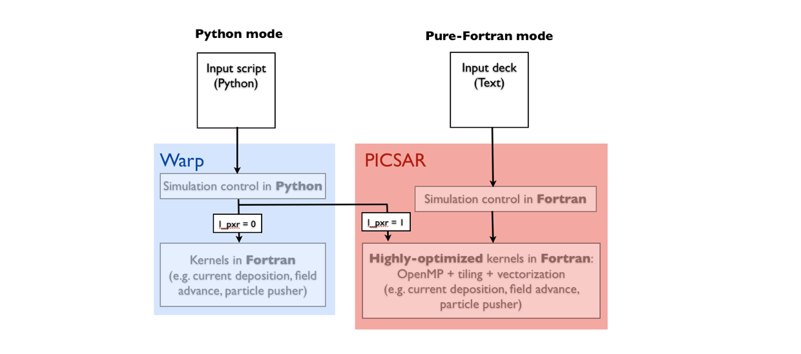
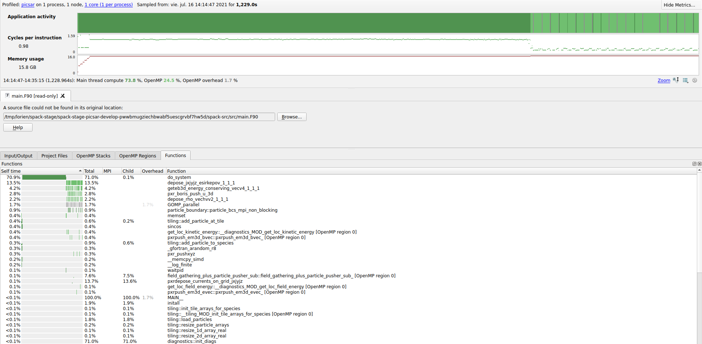
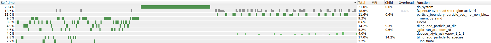
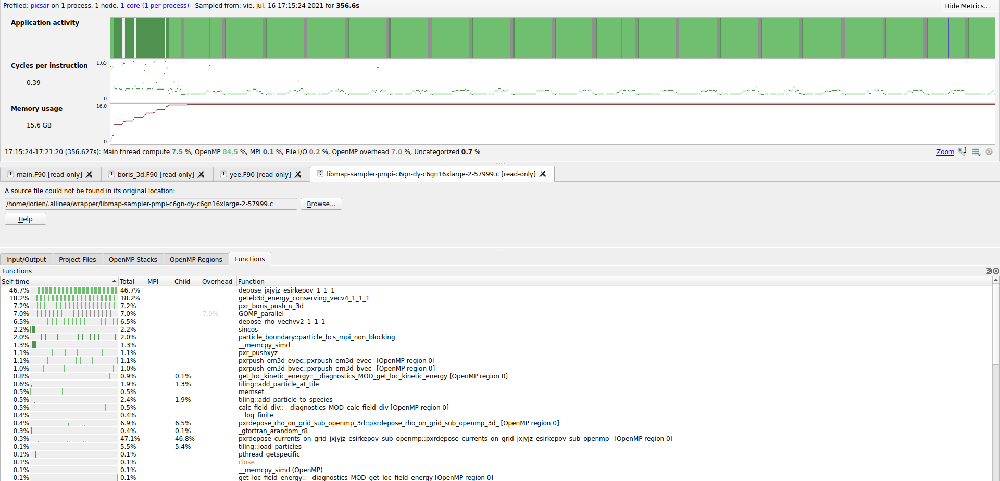

# PICSAR 

**Description:** PICSAR is a high performance library of optimized versions of the key functionalities of the PIC loop.

**URL:** https://picsar.net

**Team:** ElkNet

## Compilation

picsar depends on MPI and FFTT:

```
$ spack info picsar

MakefilePackage:   picsar

Description:
    PICSAR is a high performance library of optimized versions of the key
    functionalities of the PIC loop.

Homepage: https://picsar.net

Externally Detectable: 
    False

Tags: 
    None

Preferred version:  
    develop    [git] https://bitbucket.org/berkeleylab/picsar.git on branch master

Safe versions:  
    develop    [git] https://bitbucket.org/berkeleylab/picsar.git on branch master

Variants:
    Name [Default]         Allowed values    Description
    ===================    ==============    =============================================

    debug [off]            on, off           Debug mode
    library [off]          on, off           Create static and dynamic library
    map [off]              on, off           Allinea Map profiling
    prod [on]              on, off           Production mode (without FFTW)
    prod_spectral [off]    on, off           Production mode with spectral solver and FFTW
    sde [off]              on, off           sde profiling
    vtune [off]            on, off           Vtune profiling

Installation Phases:
    edit    build    install

Build Dependencies:
    fftw  mpi

Link Dependencies:
    fftw  mpi

Run Dependencies:
    None

Virtual Packages: 
    None
```

### Spack Package Modification

We had the following error when compiling with GCC 10.3.0 in both the x86 and the ARM cluster:
```
     25    
     26      304 |               bztile, .FALSE., l_lower_order_in_v_in, LVEC_fieldgathe,                &
     27          |                      1
     28    ......
     29     1092 |                 bztile , l4symtry_in, l_lower_order_in_v_in, lvect,                   &
     30          |                         2
  >> 31    Error: Type mismatch between actual argument at (1) and actual argument at (2) (LOGICAL(4)/LOGICAL(8)).
     32    src/particle_pushers/particle_pusher_manager_3d.F90:318:23:
     33    
     34      318 |               bztile , .FALSE., l_lower_order_in_v_in, lvec_fieldgathe,               &
     35          |                       1
     36    ......
     37     1104 |                 bztile , l4symtry_in, l_lower_order_in_v_in, lvect,                   &
     38          |                         2
  >> 39    Error: Type mismatch between actual argument at (1) and actual argument at (2) (LOGICAL(4)/LOGICAL(8)).
  >> 40    make: *** [src/particle_pushers/particle_pusher_manager_3d.o] Error 1
```

It seems that it is caused due to some changes in GCC v10. To circumvent the error, we have used the flag "-fallow-argument-mismatch". We have also opened an [issue](https://github.com/ECP-WarpX/picsar/issues/24) in the picsar repository.

New additions to the spack package.py:

```
+ if '%gcc' in self.spec:
+     targets.append('FARGS=-g -fbounds-check -O3 -fopenmp -JModules -fallow-argument-mismatch')
```

We also had some problems when compiling with thee ARM compiler:

```
==> Error: ProcessError: Command exited with status 2:
    'make' 'FC=/scratch/opt/spack/linux-amzn2-aarch64/arm-21.0.0.879/openmpi-4.1.0-lmaoy5tql4ymankvskpqsplxlig5wzvy/bin/mpif90' 'CC=/scratch/opt/spack/linux-amzn2-aarch64/arm-21.0.0.879/openmpi-4.1.0-lmaoy5tql4ymankvskpqsplxlig5wzvy/bin/mpicc' 'COMP=user' 'FARGS=-g -O3 -fopenmp' 'MODE = prod' 'SYS = default'

1 error found in build log:
     222    
     223    6 warnings generated.
     224    /scratch/opt/spack/linux-amzn2-aarch64/arm-21.0.0.879/openmpi-4.1.0-lmaoy5tql4ymankvskpqsplxlig5wzvy/bin/mpif90 -g -O3 -fopenmp -c -o src/diags/diags.o 
            src/diags/diags.F90
     225    F90-W-0547-OpenMP feature, SAFELEN, not yet implemented in this version of the compiler. (src/diags/diags.F90: 900)
     226    F90-F-0155-DO loop expected after COLLAPSE (src/diags/diags.F90: 908)
     227    F90/aarch64 Linux FlangArm F90  - 1.5 2017-05-01: compilation aborted
  >> 228    make: *** [src/diags/diags.o] Error 1
```

The OpenMP directive SAFELEN is not implemented in the ARM compiler. The execution of the SAFELEN clause is not essential for the program, so we have eliminated the two troublesome lines of code using a spack-patch:

```
def patch(self):
    if '%arm' in self.spec:
        filter_file(r'!\$OMP SIMD SAFELEN\(LVEC2\)', '', 'src/diags/diags.F90')
```

Summary of changes in the spack-package.py:
```
# spack edit picsar
# ...
    if '%gcc' in self.spec:
        targets.append('FARGS=-g -fbounds-check -O3 -fopenmp -JModules -fallow-argument-mismatch')

    return targets

+   def patch(self):
+       if '%arm' in self.spec:
+           filter_file(r'!\$OMP SIMD SAFELEN\(LVEC2\)', '', 'src/diags/diags.F90')

# ...
        targets.append('SYS = default')

+       if '%gcc' in self.spec:
+           targets.append('FARGS=-g -fbounds-check -O3 -fopenmp -JModules -fallow-argument-mismatch')
```

Git commit hash of checkout for package: TODO: What is this?

Pull request for Spack recipe changes: `https://github.com/spack/spack/pull/24927`

### Building PICSAR

#### GCC 10.3.0

```
spack install picsar%gcc@10.3.0
```

```
$ spack spec -Il picsar%gcc@10.3.0

[+]  pwwbmug  picsar@develop%gcc@10.3.0~debug~library~map+prod~prod_spectral~sde~vtune arch=linux-amzn2-graviton2
[+]  zvamksn      ^openmpi@4.1.0%gcc@10.3.0~atomics~cuda~cxx~cxx_exceptions+gpfs~internal-hwloc~java~legacylaunchers~lustre~memchecker+pmi~singularity~sqlite3+static~thread_multiple+vt+wrapper-rpath fabrics=ofi patches=60ce20bc14d98c572ef7883b9fcd254c3f232c2f3a13377480f96466169ac4c8 schedulers=slurm arch=linux-amzn2-graviton2
[+]  cukmqbg          ^hwloc@2.5.0%gcc@10.3.0~cairo~cuda~gl~libudev+libxml2~netloc~nvml+pci+shared arch=linux-amzn2-graviton2
[+]  asgtk6a              ^libpciaccess@0.16%gcc@10.3.0 arch=linux-amzn2-graviton2
[+]  z2uysov                  ^libtool@2.4.6%gcc@10.3.0 arch=linux-amzn2-graviton2
[+]  ebhjpix                      ^m4@1.4.18%gcc@10.3.0+sigsegv patches=3877ab548f88597ab2327a2230ee048d2d07ace1062efe81fc92e91b7f39cd00,fc9b61654a3ba1a8d6cd78ce087e7c96366c290bc8d2c299f09828d793b853c8 arch=linux-amzn2-graviton2
[+]  ltbv6bk                          ^libsigsegv@2.13%gcc@10.3.0 arch=linux-amzn2-graviton2
[+]  s4pw7zm                  ^pkgconf@1.7.4%gcc@10.3.0 arch=linux-amzn2-graviton2
[+]  4xr3hhh                  ^util-macros@1.19.3%gcc@10.3.0 arch=linux-amzn2-graviton2
[+]  iyhm3wi              ^libxml2@2.9.10%gcc@10.3.0~python arch=linux-amzn2-graviton2
[+]  y5ei3cm                  ^libiconv@1.16%gcc@10.3.0 arch=linux-amzn2-graviton2
[+]  ye3kcvv                  ^xz@5.2.5%gcc@10.3.0~pic libs=shared,static arch=linux-amzn2-graviton2
[+]  qepjcvj                  ^zlib@1.2.11%gcc@10.3.0+optimize+pic+shared arch=linux-amzn2-graviton2
[+]  iwzirqc              ^ncurses@6.2%gcc@10.3.0~symlinks+termlib abi=none arch=linux-amzn2-graviton2
[+]  tadxrfp          ^libevent@2.1.12%gcc@10.3.0+openssl arch=linux-amzn2-graviton2
[+]  5i3lgfb              ^openssl@1.1.1k%gcc@10.3.0~docs+systemcerts arch=linux-amzn2-graviton2
[+]  4m7exgb                  ^perl@5.32.1%gcc@10.3.0+cpanm+shared+threads arch=linux-amzn2-graviton2
[+]  y42m6yr                      ^berkeley-db@18.1.40%gcc@10.3.0+cxx~docs+stl patches=b231fcc4d5cff05e5c3a4814f6a5af0e9a966428dc2176540d2c05aff41de522 arch=linux-amzn2-graviton2
[+]  rqrpmap                      ^bzip2@1.0.8%gcc@10.3.0~debug~pic+shared arch=linux-amzn2-graviton2
[+]  2w7bert                          ^diffutils@3.7%gcc@10.3.0 arch=linux-amzn2-graviton2
[+]  wjwqncx                      ^gdbm@1.19%gcc@10.3.0 arch=linux-amzn2-graviton2
[+]  3zy7kxk                          ^readline@8.1%gcc@10.3.0 arch=linux-amzn2-graviton2
[+]  72f5gvk          ^libfabric@1.11.1-aws%gcc@10.3.0~debug~kdreg fabrics=sockets,tcp,udp arch=linux-amzn2-graviton2
[+]  mhav5gn          ^numactl@2.0.14%gcc@10.3.0 patches=4e1d78cbbb85de625bad28705e748856033eaafab92a66dffd383a3d7e00cc94,62fc8a8bf7665a60e8f4c93ebbd535647cebf74198f7afafec4c085a8825c006 arch=linux-amzn2-graviton2
[+]  jkuhz64              ^autoconf@2.69%gcc@10.3.0 arch=linux-amzn2-graviton2
[+]  xb2w5nc              ^automake@1.16.3%gcc@10.3.0 arch=linux-amzn2-graviton2
[+]  wturp6c          ^openssh@8.5p1%gcc@10.3.0 arch=linux-amzn2-graviton2
[+]  ivotdt7              ^libedit@3.1-20210216%gcc@10.3.0 arch=linux-amzn2-graviton2
[+]  wqpuvmh          ^slurm@20-02-4-1%gcc@10.3.0~gtk~hdf5~hwloc~mariadb~pmix+readline~restd sysconfdir=PREFIX/etc arch=linux-amzn2-graviton2
```

#### ARM 21.0.0.879

```
spack install picsar%arm@21.0.0.879
```

```
$ spack spec -Il picsar%arm@21.0.0.879

==> Warning: arm@21.0.0.879 cannot build optimized binaries for "graviton2". Using best target possible: "aarch64"
[+]  5xnj6wk  picsar@develop%arm@21.0.0.879~debug~library~map+prod~prod_spectral~sde~vtune arch=linux-amzn2-aarch64
[+]  lmaoy5t      ^openmpi@4.1.0%arm@21.0.0.879~atomics~cuda~cxx~cxx_exceptions+gpfs~internal-hwloc~java~legacylaunchers~lustre~memchecker+pmi~singularity~sqlite3+static~thread_multiple+vt+wrapper-rpath fabrics=ofi patches=60ce20bc14d98c572ef7883b9fcd254c3f232c2f3a13377480f96466169ac4c8 schedulers=slurm arch=linux-amzn2-aarch64
[+]  xl6anaa          ^hwloc@2.5.0%arm@21.0.0.879~cairo~cuda~gl~libudev+libxml2~netloc~nvml+pci+shared arch=linux-amzn2-aarch64
[+]  jueqz7p              ^libpciaccess@0.16%arm@21.0.0.879 arch=linux-amzn2-aarch64
[+]  e4ssqx6                  ^libtool@2.4.6%arm@21.0.0.879 arch=linux-amzn2-aarch64
[+]  i2jmeo4                      ^m4@1.4.18%arm@21.0.0.879+sigsegv patches=3877ab548f88597ab2327a2230ee048d2d07ace1062efe81fc92e91b7f39cd00,fc9b61654a3ba1a8d6cd78ce087e7c96366c290bc8d2c299f09828d793b853c8 arch=linux-amzn2-aarch64
[+]  6jhzlul                          ^libsigsegv@2.13%arm@21.0.0.879 arch=linux-amzn2-aarch64
[+]  zpuzm23                  ^pkgconf@1.7.4%arm@21.0.0.879 arch=linux-amzn2-aarch64
[+]  uwcxkin                  ^util-macros@1.19.3%arm@21.0.0.879 arch=linux-amzn2-aarch64
[+]  dypqz2i              ^libxml2@2.9.10%arm@21.0.0.879~python arch=linux-amzn2-aarch64
[+]  7vnthzn                  ^libiconv@1.16%arm@21.0.0.879 arch=linux-amzn2-aarch64
[+]  zqsab4f                  ^xz@5.2.5%arm@21.0.0.879~pic libs=shared,static arch=linux-amzn2-aarch64
[+]  puuxvg2                  ^zlib@1.2.11%arm@21.0.0.879+optimize+pic+shared arch=linux-amzn2-aarch64
[+]  uhtqtlb              ^ncurses@6.2%arm@21.0.0.879~symlinks+termlib abi=none arch=linux-amzn2-aarch64
[+]  gonqskn          ^libevent@2.1.12%arm@21.0.0.879+openssl arch=linux-amzn2-aarch64
[+]  vc3waha              ^openssl@1.1.1k%arm@21.0.0.879~docs+systemcerts arch=linux-amzn2-aarch64
[+]  vv6txro                  ^perl@5.32.1%arm@21.0.0.879+cpanm+shared+threads arch=linux-amzn2-aarch64
[+]  33wiajj                      ^berkeley-db@18.1.40%arm@21.0.0.879+cxx~docs+stl patches=b231fcc4d5cff05e5c3a4814f6a5af0e9a966428dc2176540d2c05aff41de522 arch=linux-amzn2-aarch64
[+]  z4ybgri                      ^bzip2@1.0.8%arm@21.0.0.879~debug~pic+shared arch=linux-amzn2-aarch64
[+]  adtc6yc                          ^diffutils@3.7%arm@21.0.0.879 arch=linux-amzn2-aarch64
[+]  645q4qj                      ^gdbm@1.19%arm@21.0.0.879 arch=linux-amzn2-aarch64
[+]  3haw5gt                          ^readline@8.1%arm@21.0.0.879 arch=linux-amzn2-aarch64
[+]  qdn27nh          ^libfabric@1.11.1-aws%arm@21.0.0.879~debug~kdreg fabrics=sockets,tcp,udp arch=linux-amzn2-aarch64
[+]  mv2g7r5          ^numactl@2.0.14%arm@21.0.0.879 patches=4e1d78cbbb85de625bad28705e748856033eaafab92a66dffd383a3d7e00cc94,62fc8a8bf7665a60e8f4c93ebbd535647cebf74198f7afafec4c085a8825c006 arch=linux-amzn2-aarch64
[+]  dcs645r              ^autoconf@2.69%arm@21.0.0.879 arch=linux-amzn2-aarch64
[+]  edezkz3              ^automake@1.16.3%arm@21.0.0.879 arch=linux-amzn2-aarch64
[+]  6vvthuo          ^openssh@8.5p1%arm@21.0.0.879 arch=linux-amzn2-aarch64
[+]  xe4evc4              ^libedit@3.1-20210216%arm@21.0.0.879 arch=linux-amzn2-aarch64
[+]  x5xehti          ^slurm@20-02-4-1%arm@21.0.0.879~gtk~hdf5~hwloc~mariadb~pmix+readline~restd sysconfdir=PREFIX/etc arch=linux-amzn2-aarch64
```

#### NVHPC 21.2

```
spack install picsar%nvhpc@21.2
```

```
$ spack spec -Il picsar%nvhpc@21.2

[+]  gtpbzwd  picsar@develop%nvhpc@21.2~debug~library~map+prod~prod_spectral~sde~vtune arch=linux-amzn2-graviton2
[+]  krxyvbc      ^openmpi@4.1.0%nvhpc@21.2~atomics~cuda~cxx~cxx_exceptions+gpfs~internal-hwloc~java~legacylaunchers~lustre~memchecker+pmi~singularity~sqlite3+static~thread_multiple+vt+wrapper-rpath fabrics=ofi patches=60ce20bc14d98c572ef7883b9fcd254c3f232c2f3a13377480f96466169ac4c8,fba0d3a784a9723338722b48024a22bb32f6a951db841a4e9f08930a93f41d7a schedulers=slurm arch=linux-amzn2-graviton2
[+]  jroqews          ^hwloc@2.5.0%nvhpc@21.2~cairo~cuda~gl~libudev+libxml2~netloc~nvml+pci+shared arch=linux-amzn2-graviton2
[+]  e4m4ued              ^libpciaccess@0.16%nvhpc@21.2 patches=6e08dc445ece06e9e8b1344397f2d3f169005703ddc0f2ae24f366cde78c7377 arch=linux-amzn2-graviton2
[+]  kk4ax3i                  ^libtool@2.4.6%nvhpc@21.2 arch=linux-amzn2-graviton2
[+]  6c4kz5g                      ^m4@1.4.18%nvhpc@21.2+sigsegv patches=3877ab548f88597ab2327a2230ee048d2d07ace1062efe81fc92e91b7f39cd00,5746cf51f45b405661c3edae7a78c33d41e54d83f635d16e2bf1f956dbfbf635,fc9b61654a3ba1a8d6cd78ce087e7c96366c290bc8d2c299f09828d793b853c8 arch=linux-amzn2-graviton2
[+]  pa6wm5j                          ^libsigsegv@2.13%nvhpc@21.2 arch=linux-amzn2-graviton2
[+]  vtiml6g                  ^pkgconf@1.7.4%nvhpc@21.2 arch=linux-amzn2-graviton2
[+]  4imdwuy                  ^util-macros@1.19.3%nvhpc@21.2 arch=linux-amzn2-graviton2
[+]  wo4l72s              ^libxml2@2.9.10%nvhpc@21.2~python patches=05ff238cf435825ef835c7ae39376b52dc83d8caf19e962f0766c841386a305a,10a88ad47f9797cf7cf2d7d07241f665a3b6d1f31fa026728c8c2ae93e1664e9 arch=linux-amzn2-graviton2
[+]  r7mmkdp                  ^libiconv@1.16%nvhpc@21.2 arch=linux-amzn2-graviton2
[+]  br733tn                  ^xz@5.2.5%nvhpc@21.2~pic libs=shared,static arch=linux-amzn2-graviton2
[+]  4js6ect                  ^zlib@1.2.11%nvhpc@21.2+optimize+pic+shared arch=linux-amzn2-graviton2
[+]  asgm7mt              ^ncurses@6.2%nvhpc@21.2~symlinks+termlib abi=none arch=linux-amzn2-graviton2
[+]  uttaumr          ^libevent@2.1.12%nvhpc@21.2+openssl arch=linux-amzn2-graviton2
[+]  j2qhi7h              ^openssl@1.1.1k%nvhpc@21.2~docs+systemcerts arch=linux-amzn2-graviton2
[+]  gn4fgp5                  ^perl@5.32.1%nvhpc@21.2+cpanm+shared+threads patches=21cf6a73cec16760f8de2e8895ace1299aff2d8e92dc581cd18f1d95a4503048 arch=linux-amzn2-graviton2
[+]  5uyf3k4                      ^berkeley-db@18.1.40%nvhpc@21.2+cxx~docs+stl patches=b231fcc4d5cff05e5c3a4814f6a5af0e9a966428dc2176540d2c05aff41de522 arch=linux-amzn2-graviton2
[+]  wsi7g3j                      ^bzip2@1.0.8%nvhpc@21.2~debug~pic+shared arch=linux-amzn2-graviton2
[+]  s4mb5no                          ^diffutils@3.7%nvhpc@21.2 patches=6e42dc243f17aab29fd167f060f5bc1f08813e03368eb301b43c95d4b1386681 arch=linux-amzn2-graviton2
[+]  m2wdbeo                      ^gdbm@1.19%nvhpc@21.2 arch=linux-amzn2-graviton2
[+]  zori3wf                          ^readline@8.1%nvhpc@21.2 arch=linux-amzn2-graviton2
[+]  xl6zavq          ^libfabric@1.11.1-aws%nvhpc@21.2~debug~kdreg fabrics=sockets,tcp,udp arch=linux-amzn2-graviton2
[+]  5yq4tpw          ^numactl@2.0.14%nvhpc@21.2 patches=4e1d78cbbb85de625bad28705e748856033eaafab92a66dffd383a3d7e00cc94,62fc8a8bf7665a60e8f4c93ebbd535647cebf74198f7afafec4c085a8825c006 arch=linux-amzn2-graviton2
[+]  fo57byt              ^autoconf@2.69%nvhpc@21.2 arch=linux-amzn2-graviton2
[+]  gmd4264              ^automake@1.16.3%nvhpc@21.2 arch=linux-amzn2-graviton2
[+]  cl3ohqo          ^openssh@8.5p1%nvhpc@21.2 arch=linux-amzn2-graviton2
[+]  yvqpq74              ^libedit@3.1-20210216%nvhpc@21.2 arch=linux-amzn2-graviton2
[+]  zehhooy          ^slurm@20-02-4-1%nvhpc@21.2~gtk~hdf5~hwloc~mariadb~pmix+readline~restd sysconfdir=PREFIX/etc arch=linux-amzn2-graviton2
```

## Usage

PICSAR can be run in two modes:

- In pure-Fortran mode: in this case, the code is run as a stand-alone application.

- In Python mode: in this case, PICSAR is used as a Python module. It can be used with existing code (e.g. Warp) to accelerate simulations by rerouting the calls to the low-level kernels (current deposition, field advance, particle pusher). More precisely, in this case, instead of calling Warp's regular kernels, the simulation will call PICSAR's highly-optimized kernels.



We will use the pure-fortran version in all of our benchmarks as it will always be as fast or faster than the python version.

## Plasma_test test-case

This is one of Picsar's performance tests. It can be found [here](https://github.com/ECP-WarpX/picsar/blob/development/performance_tests/perf_test1).

[ReFrame Benchmark](perf1.py)

```
export PYTHONPATH="PARENT_FOLDER_OF_THE_SCRIPT:$PYTHONPATH"
reframe -c perf1.py -r --performance-report
```

### Validation

In order to validate the execution of the application, we perform the same test that is performed in the [acceptance tests](https://github.com/ECP-WarpX/picsar/tree/development/Acceptance_testing/Fortran_tests) of the application. The test consist on compiting the relative error on the total energy and checking that it is tolerable.

### On-node Compiler Comparison

On-node scaling study comparing different compilers.

#### ReFrame Output

```
==============================================================================
PERFORMANCE REPORT
------------------------------------------------------------------------------
PICSAR_PICSAR-PERF1_picsar_gcc_10_3_0_N_1_MPI_1_OMP_1
- aws:c6gn
   - builtin
      * num_tasks: 1
      * Total Time: 363.18 s
------------------------------------------------------------------------------
PICSAR_PICSAR-PERF1_picsar_gcc_10_3_0_N_1_MPI_1_OMP_2
   - builtin
      * num_tasks: 1
      * Total Time: 198.76 s
------------------------------------------------------------------------------
PICSAR_PICSAR-PERF1_picsar_gcc_10_3_0_N_1_MPI_1_OMP_4
   - builtin
      * num_tasks: 1
      * Total Time: 118.28 s
------------------------------------------------------------------------------
PICSAR_PICSAR-PERF1_picsar_gcc_10_3_0_N_1_MPI_1_OMP_8
   - builtin
      * num_tasks: 1
      * Total Time: 78.52 s
------------------------------------------------------------------------------
PICSAR_PICSAR-PERF1_picsar_gcc_10_3_0_N_1_MPI_1_OMP_16
   - builtin
      * num_tasks: 1
      * Total Time: 59.73 s
------------------------------------------------------------------------------
PICSAR_PICSAR-PERF1_picsar_gcc_10_3_0_N_1_MPI_1_OMP_32
   - builtin
      * num_tasks: 1
      * Total Time: 51.2 s
------------------------------------------------------------------------------
PICSAR_PICSAR-PERF1_picsar_gcc_10_3_0_N_1_MPI_1_OMP_64
   - builtin
      * num_tasks: 1
      * Total Time: 47.69 s
------------------------------------------------------------------------------
PICSAR_PICSAR-PERF1_picsar_arm_21_0_0_879_N_1_MPI_1_OMP_1
   - builtin
      * num_tasks: 1
      * Total Time: 304.59 s
------------------------------------------------------------------------------
PICSAR_PICSAR-PERF1_picsar_arm_21_0_0_879_N_1_MPI_1_OMP_2
   - builtin
      * num_tasks: 1
      * Total Time: 173.79 s
------------------------------------------------------------------------------
PICSAR_PICSAR-PERF1_picsar_arm_21_0_0_879_N_1_MPI_1_OMP_4
   - builtin
      * num_tasks: 1
      * Total Time: 110.43 s
------------------------------------------------------------------------------
PICSAR_PICSAR-PERF1_picsar_arm_21_0_0_879_N_1_MPI_1_OMP_8
   - builtin
      * num_tasks: 1
      * Total Time: 76.43 s
------------------------------------------------------------------------------
PICSAR_PICSAR-PERF1_picsar_arm_21_0_0_879_N_1_MPI_1_OMP_16
   - builtin
      * num_tasks: 1
      * Total Time: 61.44 s
------------------------------------------------------------------------------
PICSAR_PICSAR-PERF1_picsar_arm_21_0_0_879_N_1_MPI_1_OMP_32
   - builtin
      * num_tasks: 1
      * Total Time: 55.02 s
------------------------------------------------------------------------------
PICSAR_PICSAR-PERF1_picsar_arm_21_0_0_879_N_1_MPI_1_OMP_64
   - builtin
      * num_tasks: 1
      * Total Time: 52.85 s
------------------------------------------------------------------------------
PICSAR_PICSAR-PERF1_picsar_nvhpc_21_2_N_1_MPI_1_OMP_1
   - builtin
      * num_tasks: 1
      * Total Time: 313.83 s
------------------------------------------------------------------------------
PICSAR_PICSAR-PERF1_picsar_nvhpc_21_2_N_1_MPI_1_OMP_2
   - builtin
      * num_tasks: 1
      * Total Time: 176.92 s
------------------------------------------------------------------------------
PICSAR_PICSAR-PERF1_picsar_nvhpc_21_2_N_1_MPI_1_OMP_4
   - builtin
      * num_tasks: 1
      * Total Time: 105.29 s
------------------------------------------------------------------------------
PICSAR_PICSAR-PERF1_picsar_nvhpc_21_2_N_1_MPI_1_OMP_8
   - builtin
      * num_tasks: 1
      * Total Time: 73.97 s
------------------------------------------------------------------------------
PICSAR_PICSAR-PERF1_picsar_nvhpc_21_2_N_1_MPI_1_OMP_16
   - builtin
      * num_tasks: 1
      * Total Time: 57.29 s
------------------------------------------------------------------------------
PICSAR_PICSAR-PERF1_picsar_nvhpc_21_2_N_1_MPI_1_OMP_32
   - builtin
      * num_tasks: 1
      * Total Time: 50.2 s
------------------------------------------------------------------------------
PICSAR_PICSAR-PERF1_picsar_nvhpc_21_2_N_1_MPI_1_OMP_64
   - builtin
      * num_tasks: 1
      * Total Time: 47.16 s
------------------------------------------------------------------------------
```

#### Comparison

| OMP threads | GCC 10.3.0 | ARM 21.0.0.879  | NVHPC 21.2  |
|-------------|------------|-----------------|-------------|
|    1        |  363.18 s  |    304.59 s     |   313.83 s  |
|    2        |  198.76 s  |    173.79 s     |   176.92 s  |
|    4        |  118.28 s  |    110.43 s     |   105.29 s  |
|    8        |  78.52 s   |     76.43 s     |   73.97 s   |
|    16       |  59.73 s   |     61.44 s     |   57.29 s   |
|    32       |  51.2 s    |      55.02 s    |    50.2 s   |
|    64       |  47.69 s   |     52.85 s     |   47.16 s   |

Comparing the results obtained with different compilers, we can see the NVHPC 21.2 compiler performs a bit better than the others. However, when using a great number of OMP threads, the execution time of each compiler is very similar. In this test, we can get almost the maximum performance by only using  32 OMP threads.

### Off-Node Compiler Comparison

Off-node scaling study comparing different compilers.

#### ReFrame Output

```
==============================================================================
PERFORMANCE REPORT
------------------------------------------------------------------------------
PICSAR_PICSAR-PERF1_picsar_gcc_10_3_0_N_1_MPI_1_OMP_64
- aws:c6gn
   - builtin
      * num_tasks: 1
      * Total Time: 46.29 s
------------------------------------------------------------------------------
PICSAR_PICSAR-PERF1_picsar_gcc_10_3_0_N_2_MPI_2_OMP_64
   - builtin
      * num_tasks: 2
      * Total Time: 26.0 s
------------------------------------------------------------------------------
PICSAR_PICSAR-PERF1_picsar_gcc_10_3_0_N_4_MPI_4_OMP_64
   - builtin
      * num_tasks: 4
      * Total Time: 15.73 s
------------------------------------------------------------------------------
PICSAR_PICSAR-PERF1_picsar_gcc_10_3_0_N_8_MPI_8_OMP_64
   - builtin
      * num_tasks: 8
      * Total Time: 10.23 s
------------------------------------------------------------------------------
PICSAR_PICSAR-PERF1_picsar_arm_21_0_0_879_N_1_MPI_1_OMP_64
   - builtin
      * num_tasks: 1
      * Total Time: 51.44 s
------------------------------------------------------------------------------
PICSAR_PICSAR-PERF1_picsar_arm_21_0_0_879_N_2_MPI_2_OMP_64
   - builtin
      * num_tasks: 2
      * Total Time: 27.36 s
------------------------------------------------------------------------------
PICSAR_PICSAR-PERF1_picsar_arm_21_0_0_879_N_4_MPI_4_OMP_64
   - builtin
      * num_tasks: 4
      * Total Time: 16.04 s
------------------------------------------------------------------------------
PICSAR_PICSAR-PERF1_picsar_arm_21_0_0_879_N_8_MPI_8_OMP_64
   - builtin
      * num_tasks: 8
      * Total Time: 10.04 s
------------------------------------------------------------------------------
PICSAR_PICSAR-PERF1_picsar_nvhpc_21_2_N_1_MPI_1_OMP_64
   - builtin
      * num_tasks: 1
      * Total Time: 45.72 s
------------------------------------------------------------------------------
PICSAR_PICSAR-PERF1_picsar_nvhpc_21_2_N_2_MPI_2_OMP_64
   - builtin
      * num_tasks: 2
      * Total Time: 24.95 s
------------------------------------------------------------------------------
PICSAR_PICSAR-PERF1_picsar_nvhpc_21_2_N_4_MPI_4_OMP_64
   - builtin
      * num_tasks: 4
      * Total Time: 14.09 s
------------------------------------------------------------------------------
PICSAR_PICSAR-PERF1_picsar_nvhpc_21_2_N_8_MPI_8_OMP_64
   - builtin
      * num_tasks: 8
      * Total Time: 8.73 s
------------------------------------------------------------------------------
```

#### Comparison

| Nodes | Total MPI ranks |  OMP threads/MPI rank  | GCC 10.3.0 | ARM 21.0.0.879 | NVHPC 21.2 |
|-------|-----------------|------------------------|------------|----------------|------------|
|    1  |      1          |          64            |  46.29 s   |    51.44 s     |  45.72 s   | 
|    2  |      2          |          64            |  26.0 s    |    27.36 s     |  24.95 s   | 
|    4  |      4          |          64            |  15.73 s   |    16.04 s     |  14.09 s   | 
|    8  |      8          |          64            |  10.23 s   |    10.04 s     |   8.73 s   | 

As the execution time when using 32 and 64 OMP threads was almost the same, we did not expect to see any performance improvement when using more than one node. However, this comparison shows that we were wrong.

### On-Node Architecture Comparison

On-node scaling study for two architectures.

| Cores | C6gn (Aarch64) GCC-10.3.0 | C5n (X86) GCC-10.3.0 |
|-------|---------------------------|----------------------|
| 1     |          363.18 s         |       280.88 s       |
| 2     |          198.76 s         |       160.18 s       |
| 4     |          118.28 s         |       99.26 s        |
| 8     |          78.52 s          |       68.94 s        |
| 16    |          59.73 s          |       56.12 s        |
| 32    |          51.2 s           |       54.06 s        |
| 64    |          47.69 s          |       55.72 s        |

For this comparison, we used GCC as the reference compiler as it is installed in both the Arm and in x86 clusters. The performance of the x86 cluster is significantly better when using a few cores, but the gap closes as we use more.

### Off-Node Architecture Comparison

Off-node scaling study for two architectures.

| Nodes | Total MPI ranks |  OMP threads/MPI rank  | C6gn (Aarch64) |   C5n (X86)    |
|-------|-----------------|------------------------|----------------|----------------|
|    1  |      1          |          64            |    46.29 s     |    58.62 s     |
|    2  |      2          |          64            |    26.0 s      |    32.76 s     |
|    4  |      4          |          64            |    15.73 s     |    20.02 s     |
|    8  |      8          |          64            |    10.23 s     |    13.3 s      |

We used GCC as the reference compiler as it is installed in both the Arm and in x86 clusters. Overall, the ARM cluster seems to perform better than the x86 one, when using a great number of processes/threads.

### Serial Hot-spot Profile

To profile the serial execution of the app we have used the Arm Forge (MAP) profiler. [This](armforge-perf1-serial.sh) is the script that has been used to run the profiler.



### Full Node Hot-spot Profile

To profile the Full Node MPI execution of the app we have used the Arm Forge (MAP) profiler. [This](armforge-perf1-full_node.sh) is the script that has been used to run the profiler.



The do_system(), which is the application's bottleneck, is just a call to `mkdir` and then to `rm`. These two commands are only used to create the RESULTS folder, so we tried to avoid executing both commands using a spack patch:

```
filter_file(r'IF \(rank.eq.0\) CALL system\(\'mkdir RESULTS\'\)', '', 'src/diags/diags.F90')
filter_file(r'IF \(rank.eq.0\) CALL system\(\'rm RESULTS\/\*\'\)', '', 'src/diags/diags.F90')
```

This patch produced very weirds results. The execution time when not using ARMForge is identical to the obtained before applying the patch. However, the execution time when using ARMForge significantly decreases:



In conclusion, it seems that the ARMForge profiler is introducing a very significant overhead when performing the system calls.

## Optimisation

### Compiler Flag Tuning

Compiler flags before:
```
if '%gcc' in self.spec:
    targets.append('FARGS=-g -fbounds-check -O3 -fopenmp -JModules -fallow-argument-mismatch')
elif '%arm' in self.spec:
    targets.append('FARGS=-g -O3 -fopenmp')
elif '%nvhpc' in self.spec:
    targets.append('FARGS=-g -O3 -fopenmp')
```

Compiler flags after (Spack configuration):
```
if '%gcc' in self.spec:
    targets.append('FARGS=-g -fbounds-check -Ofast -march=native -fopenmp -JModules -fallow-argument-mismatch')
elif '%arm' in self.spec:
    targets.append('FARGS=-g -Ofast -mtune=native -mcpu=native -fopenmp')
elif '%nvhpc' in self.spec:
    targets.append('FARGS=-g -fast -O3 -fopenmp')
```

#### Compiler Flag Performance

##### BEFORE FLAG TUNNING

| OMP threads | GCC 10.3.0 | ARM 21.0.0.879  | NVHPC 21.2  |
|-------------|------------|-----------------|-------------|
|    1        |  363.18 s  |    304.59 s     |   313.83 s  |
|    2        |  198.76 s  |    173.79 s     |   176.92 s  |
|    4        |  118.28 s  |    110.43 s     |   105.29 s  |
|    8        |  78.52 s   |     76.43 s     |   73.97 s   |
|    16       |  59.73 s   |     61.44 s     |   57.29 s   |
|    32       |  51.2 s    |      55.02 s    |    50.2 s   |
|    64       |  47.69 s   |     52.85 s     |   47.16 s   |

##### AFTER FLAG TUNNING

| OMP threads | GCC 10.3.0 | ARM 21.0.0.879  | NVHPC 21.2  |
|-------------|------------|-----------------|-------------|
|    1        |  360.93 s  |   322.28 s      |   314.6 s   |
|    2        |  197.28 s  |   182.77 s      |   177.41 s  |
|    4        |  117.32 s  |   114.48 s      |   107.04 s  |
|    8        |  77.72 s  |    78.18 s       |   73.3 s    |
|    16       |  59.42 s  |    62.22 s       |   56.26 s   |
|    32       |  50.72 s  |    54.55 s       |   48.95 s   |
|    64       |  47.64 s  |    51.88 s       |   46.19 s   |

In this experiment, we do not get any improvements in the performance with the flags tested. The application even performs worse in some cases with the new flags. The increments or decrements in
execution time are small enough to consider that the flags tried do not have any effect in the performance.

## Report

### Compilation Summary

We had some problems in application with some compilers. With gcc@10.3.0, we had some type mismatch problems. We solved it by using the flag "-fallow-argument-mismatch". The reason for this error is some changes in GCCv10. We also had errors with arm@21.0.0.879. The bug consisted that the OpenMP directive SAFELEN is not implemented in the ARM compiler. In order to fix this we had to edit the spack file in order to apply a patch. For more details please check the Compilation section.

### Performance Summary

According to the comparison tests, the best compiler for this application is nvhpc@21.2. The on-node scalability is not very good, but the it unexpectedly improves when using more than one node. In terms of architecture, Arm performs better in every scenario of the off-node comparison. However, there is no clear winner in the in-node comparison. Intel has much better performance when using a few threads, but as the number of threads increases, the gap between both architectures decreases.

### Optimisation Summary

We tried to tune the compiler flags as explained in the compiler flag performance section. However, we didn't get any noticeable improvements.
What is more relevant is the patch applied to the application to solve the bottleneck found in the profiling section. As explained before, we didn't get any performance improvements when using ARMForge. Nevertheless, we obtained near 3.4X improvement when executing ARMForge after the patch, compared to executing ARMForge before applying it. This makes us think that the ARM profiler is introducing significant overhead when performing system calls. Please check Hot-Spot Profile section for more details.
