# miniGMG 

**Description:** miniGMG is a compact benchmark for understanding the performance challenges associated with geometric multigrid solvers found in applications built from AMR MG frameworks like CHOMBO or BoxLib when running on modern multi- and manycore-based supercomputers. It includes both productive reference examples as well as highly-optimized implementations for CPUs and GPUs. It is sufficiently general that it has been used to evaluate a broad range of research topics including PGAS programming models and algorithmic tradeoffs inherit in multigrid. miniGMG was developed under the CACHE Joint Math-CS Institute. Note, miniGMG code has been supersceded by HPGMG.

**URL:** http://crd.lbl.gov/departments/computer-science/PAR/research/previous-projects/miniGMG/

**Team:**  WolfPack

## Compilation

### Spack Package Modification

Details of any changes to the Spack recipe used.

Git commit hash of checkout for pacakage:

Pull request for Spack recipe changes:

### Building miniGMG


#### Compiler 1

```
spack install <app>%<compiler1>
```

```
$ spack spec -Il <app>%<compiler1>

```

## Test Case 1

[ReFrame Benchmark 1](#)

```
../bin/reframe -c benchmark.py -r --performance-report
```

## Test Case 2

[ReFrame Benchmark 2](#)

```
../bin/reframe -c benchmark.py -r --performance-report
```

## Test Case 3

[ReFrame Benchmark 3](#)

```
../bin/reframe -c benchmark.py -r --performance-report
```

## Test Case 4

[ReFrame Benchmark 4](#)

```
../bin/reframe -c benchmark.py -r --performance-report
```

### Validation

miniGMG reduces the norm until it is less than 1e-15. If the norm is still greater than 1e-15 after `maxVCycles` v-cycles, the program will ends with incorrect results. So we check if all the norms produced by last v-cycles are less than 1e-15.


### ReFrame Output

```
==============================================================================
PERFORMANCE REPORT
------------------------------------------------------------------------------
     **** 
------------------------------------------------------------------------------
```

### On-node Compiler Comparison

Performance comparison of two compilers.

| Cores | Compiler 1 | Compiler 2 |
|-------|------------|------------|
| 1     |            |            |
| 2     |            |            |
| 4     |            |            |
| 8     |            |            |
| 16    |            |            |
| 32    |            |            |
| 64    |            |            |


### Serial Hot-spot Profile

List of top-10 functions / code locations from a serial profile.

#### Test Case 1  
Profiling script:  
[ReFrame Benchmark](reframe_scripts/benchmark_p4_test1_gcc.py)  
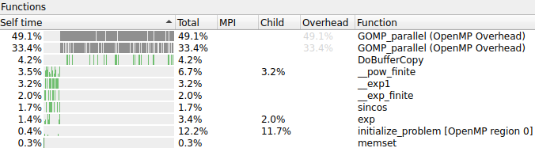

#### Test Case 2
Profiling script:  
[ReFrame Benchmark](reframe_scripts/benchmark_p4_test2_gcc.py)  
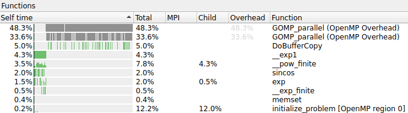

#### Test Case 3
Profiling script:  
[ReFrame Benchmark](reframe_scripts/benchmark_p4_test3_gcc.py)  
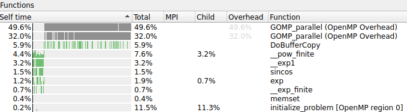

#### Test Case 4
Profiling script:  
[ReFrame Benchmark](reframe_scripts/benchmark_p4_test4_gcc.py)  
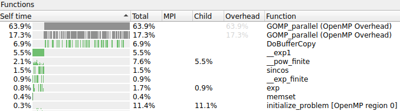

### Full Node Hot-spot Profile

List of top-10 functions / code locations from a full node profile.

#### gcc
#### Test Case 1  
Profiling script:  
[ReFrame Benchmark](reframe_scripts/benchmark_p5_test1_gcc.py)  
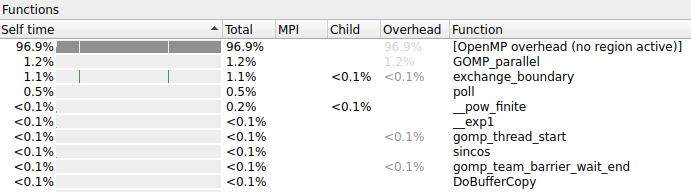

#### Test Case 2
Profiling script:  
[ReFrame Benchmark](reframe_scripts/benchmark_p5_test2_gcc.py)  
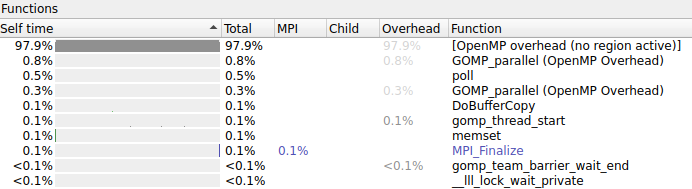

#### Test Case 3
Profiling script:  
[ReFrame Benchmark](reframe_scripts/benchmark_p5_test3_gcc.py)  
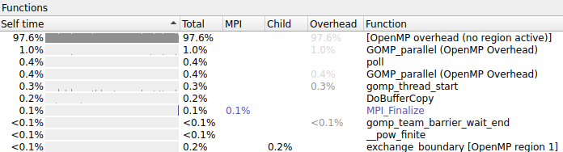

#### Test Case 4
Profiling script:  
[ReFrame Benchmark](reframe_scripts/benchmark_p5_test4_gcc.py)  
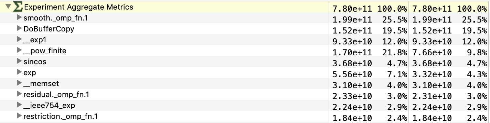

#### arm
#### Test Case 1  
Profiling script:  
[ReFrame Benchmark](reframe_scripts/benchmark_p5_test1_arm.py)  
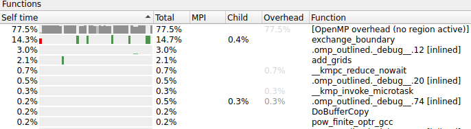

#### Test Case 2
Profiling script:  
[ReFrame Benchmark](reframe_scripts/benchmark_p5_test2_arm.py)  
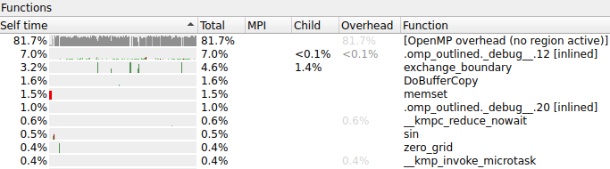

#### Test Case 3
Profiling script:  
[ReFrame Benchmark](reframe_scripts/benchmark_p5_test3_arm.py)  
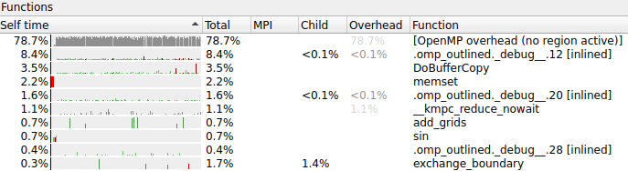

#### Test Case 4
Profiling script:  
[ReFrame Benchmark](reframe_scripts/benchmark_p5_test4_arm.py)  
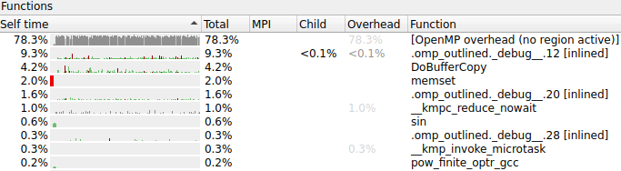

### Strong Scaling Study
On-node scaling study for two compilers.

#### Test Case 1
arm script:   
[ReFrame Benchmark](#)    
gcc script:   
[ReFrame Benchmark](#)    
| Cores | arm | gcc |
|-------|------------|------------|
| 1     | 17.19 s           | 17.18 s           |
| 2     | 9.95 s           | 11.57 s           |
| 4     | 5.98 s           | 7.33 s           |
| 8     | 4.35 s           | 6.31 s           |
| 16    | 3.58 s           | 7.81 s           |
| 32    | 3.71 s           | 11.39 s           |
| 64    | 3.91 s           | 19.33 s           |

#### Test Case 2
arm script:   
[ReFrame Benchmark](#)    
gcc script:   
[ReFrame Benchmark](#)    

| Cores | arm | gcc |
|-------|------------|------------|
| 1     | 124.5 s           | 127.3 s           |
| 2     | 83.3 s           | 84.14 s           |
| 4     | 52.5 s            | 52.06 s           |
| 8     | 35.18 s           | 41.18 s           |
| 16    | 25.2 s           | 51.58 s           |
| 32    | 18.27 s           | 82.87 s           |
| 64    | 11.56 s           | 131.02 s           |

#### Test Case 3
arm script:   
[ReFrame Benchmark](#)    
gcc script:   
[ReFrame Benchmark](#)    
| Cores | arm | gcc |
|-------|------------|------------|
| 1     | 1011.12 s           | 1060.55 s           |
| 2     | 625.56 s           | 643.84 s           |
| 4     | 397.64 s           | 401.97 s           |
| 8     | 273.77 s           | 314.23 s           |
| 16    | 199.31 s           | 418.16 s           |
| 32    | 134.02 s           | 686.54 s           |
| 64    | 81.45 s           | 1097.58 s           |

#### Test Case 4
arm script:   
[ReFrame Benchmark](#)    
gcc script:   
[ReFrame Benchmark](#)    

| Cores | arm | gcc |
|-------|------------|------------|
| 1     |            |         |
| 2     |            | 1733.35 s             |
| 4     |            | 990.99 s           |
| 8     |            | 789.04 s            |
| 16    |            | 1048.72 s          |
| 32    |            | 1906.81 s           |
| 64    |            |            |

### On-Node Architecture Comparison

On-node scaling study for two architectures.  
Compiler: gcc
#### Test Case 1
X86 script:  
[ReFrame Benchmark](#)  
ARM script:  
[ReFrame Benchmark](#)  
Time: 
| Cores | C6gn (ARM) | C5n (X86) |
|-------|------------|-----------|
| 1     | 17.18 s           | 19.09 s   |
| 2     | 11.57 s           | 23.29 s   |
| 4     | 7.33 s           | 20.83 s   |
| 8     | 6.31 s           | 19.91 s   |
| 16    | 7.81 s           | 22.06 s   |
| 32    | 11.39 s           | 30.28 s   |
| 64    | 19.33 s           | 46.11 s   |

#### Test Case 2
X86 script:  
[ReFrame Benchmark](#)  
ARM script:  
[ReFrame Benchmark](#)  
Time:
| Cores | C6gn (ARM) | C5n (X86) |
|-------|------------|-----------|
| 1     | 127.3 s           | 164.75 s  |
| 2     | 84.14 s           | 128.39 s  |
| 4     | 52.06 s           | 85.88 s   |
| 8     | 41.18 s           | 72.85 s   |
| 16    | 51.58 s           | 84.45 s   |
| 32    | 82.87 s           | 142.46 s  |
| 64    | 131.02 s           | 252.93 s  |

#### Test Case 3
X86 script:  
[ReFrame Benchmark](#)  
ARM script:  
[ReFrame Benchmark](#)  
Time:
| Cores | C6gn (ARM) | C5n (X86) |
|-------|------------|-----------|
| 1     | 1060.55 s           | 1335.42 s |
| 2     | 643.84 s           | 981.23 s  |
| 4     | 401.97 s           | 627.84 s  |
| 8     | 314.23 s           | 543.84 s  |
| 16    | 418.16 s           | 640.72 s  |
| 32    | 686.54 s           | 1087.96 s |
| 64    | 1097.58 s           | 2025.36 s |

#### Test Case 4
X86 script:  
[ReFrame Benchmark](#)  
ARM script:  
[ReFrame Benchmark](#)  
Time:

| Cores | C6gn (ARM) | C5n (X86) |
|-------|------------|-----------|
| 1     |            | 4790.18 s |
| 2     | 1733.35 s           | 3343.18 s |
| 4     | 990.99 s           | 1994.46 s |
| 8     | 789.04 s           | 1305.74 s |
| 16    | 1048.72 s           | 1915.15 s |
| 32    | 1906.81 s           | 3563.73 s |
| 64    |            | 7220.35 s |

### Off-Node Architecture Comparison

Off-node scaling study for two architectures.

#### Test Case 1
X86 script:  
[ReFrame Benchmark](#)  
ARM script:  
[ReFrame Benchmark](#)  
Time:

| Nodes | Cores | C6gn (ARM) |  C5n (X86) |
|-------|-------|------------|------------|
| 1     | 32    | 11.39 s	           | 30.28 s    |
| 1     | 64    | 19.33 s           | 46.11 s    |
| 2     | 128   | 11.34 s           | 33.52 s    |
| 4     | 256   | 7.67 s           | 26.4 s     |

#### Test Case 2
X86 script:  
[ReFrame Benchmark](#)  
ARM script:  
[ReFrame Benchmark](#)  
Time:
| Nodes | Cores | C6gn (ARM) |  C5n (X86) |
|-------|-------|------------|------------|
| 1     | 32    | 82.87 s           | 142.46 s   |
| 1     | 64    | 131.02 s           | 252.93 s   |
| 2     | 128   | 68.77 s           | 141.92 s   |
| 4     | 256   | 37.38 s           | 82.26 s    |

#### Test Case 3
X86 script:  
[ReFrame Benchmark](#)  
ARM script:  
[ReFrame Benchmark](#)  
Time:
| Nodes | Cores | C6gn (ARM) |  C5n (X86) |
|-------|-------|------------|------------|
| 1     | 32    | 686.54 s           | 1087.96 s  |
| 1     | 64    | 1097.58 s           | 2025.36 s  |
| 2     | 128   | 559.38 s           | 1027.75 s  |
| 4     | 256   | 283.53 s          | 526.23 s   |

#### Test Case 4
X86 script:  
[ReFrame Benchmark](#)  
ARM script:  
[ReFrame Benchmark](#)  
Time:

| Nodes | Cores | C6gn (ARM) |  C5n (X86) |
|-------|-------|------------|------------|
| 1     | 32    | 1906.81 s           | 3563.73 s  |
| 1     | 64    |            | 7220.35 s  |
| 2     | 128   | 1879.59 s           | 3421.94 s  |
| 4     | 256   | 942.39 s           | 1732.57 s  |

## Optimisation

Details of steps taken to optimise performance of the application.
Please document work with compiler flags, maths libraries, system libraries, code optimisations, etc.

### Compiler Flag Tuning

Compiler flags before:
```
CFLAGS= -O3 -fopenmp  -lm -Daarch64 -D__MPI -D__COLLABORATIVE_THREADING=6 -D__TEST_MG_CONVERGENCE -D__PRINT_NORM -D__USE_BICGSTAB 
FFLAGS=
```

Compiler flags after:
```
CFLAGS= -O3 -Ofast -fopenmp -lm -Daarch64 -D__MPI -D__TEST_MG_CONVERGENCE -D__PREFETCH_NEXT_PLANE_FROM_DRAM -D__FUSION_RESIDUAL_RESTRICTION -D__PRINT_NORM -D__USE_BICGSTAB 
FFLAGS=
```

#### Compiler Flag Performance

| Cores | Original Flags | New Flags |
|-------|----------------|-----------|
| 1     |                |           |
| 2     |                |           |
| 4     |                |           |
| 8     |                |           |
| 16    |                |           |
| 32    |                |           |
| 64    |                |           |


### Maths Library Report

Report on use of maths library calls generated by (Perf Lib Tools)[https://github.com/ARM-software/perf-libs-tools].
Please attach the corresponding apl files.


### Maths Library Optimisation

Performance analysis of the use of different maths libraries.


| Cores | OpenBLAS | ArmPL | BLIS |
|-------|----------|-------| ---- |
| 1     |          |       |      |
| 2     |          |       |      |
| 4     |          |       |      |
| 8     |          |       |      |
| 16    |          |       |      |
| 32    |          |       |      |
| 64    |          |       |      |


### Performance Regression

How fast can you make the code?

#### 

| Cores | Original Flags | New Flags |
| ----- | -------------- | --------- |
| 1     |                |           |
| 2     |                |           |
| 4     |                |           |
| 8     |                |           |
| 16    |                |           |
| 32    |                |           |
| 64    |                |           |

Use all of the above aproaches and any others to make the code as fast as possible.
Demonstrate your gains by providing a scaling study for your test case, demonstrating the performance before and after.


## Report

### Compilation Summary

Details of lessons from compiling the application.

### Performance Summary

Details of lessons from analysing the performance of the application.


### Optimisation Summary

Details of lessons from performance optimising the application.
