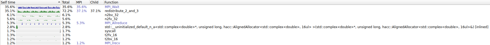

# swfft 

**Description:** A stand-alone version of HACC's distributed-memory, pencil-decomposed, parallel 3D FFT.

**URL:** https://xgitlab.cels.anl.gov/hacc/SWFFT

**Team:** ElkNet

## Compilation

SWFFT depends on MPI and FFTT:

```
$ spack info swfft

MakefilePackage:   swfft

Description:
    A stand-alone version of HACC's distributed-memory, pencil-decomposed,
    parallel 3D FFT.

Homepage: https://xgitlab.cels.anl.gov/hacc/SWFFT

Externally Detectable: 
    False

Tags: 
    ecp-proxy-app  proxy-app

Preferred version:  
    1.0        https://xgitlab.cels.anl.gov/api/v4/projects/hacc%2FSWFFT/repository/archive.tar.gz?sha=v1.0

Safe versions:  
    develop    [git] https://xgitlab.cels.anl.gov/hacc/SWFFT.git on branch master
    1.0        https://xgitlab.cels.anl.gov/api/v4/projects/hacc%2FSWFFT/repository/archive.tar.gz?sha=v1.0

Variants:
    None

Installation Phases:
    edit    build    install

Build Dependencies:
    fftw  mpi

Link Dependencies:
    fftw  mpi

Run Dependencies:
    None

Virtual Packages: 
    None
```

Git commit hash of checkout for pacakage: fe5c226d

Pull request for Spack recipe changes: TODO: What is this?

### Spack Package Modification

Details of any changes to the Spack recipe used.

The existing Spack package does not set the correct output granularity for maximum performance, which is `DFFT_TIMING=0`.

```
# spack edit cloverleaf
# ...
          targets.append('DFFT_MPI_CC=%s' % spec['mpi'].mpicc)
          targets.append('DFFT_MPI_CXX=%s' % spec['mpi'].mpicxx)
          targets.append('DFFT_MPI_F90=%s' % spec['mpi'].mpifc)

+         targets.append('DFFT_MPI_CPPFLAGS=-DDFFT_TIMING=0')
```

Git commit hash of checkout for pacakage: fe5c226d

Pull request for Spack recipe changes: TODO: What is this?

### Building SWFFT

#### GCC 10.3.0

```
spack install swfft@1.0%gcc@10.3.0
```

```
$ spack spec -Il swfft@1.0%gcc@10.3.0

[+]  estt4jj  swfft@1.0%gcc@10.3.0 patches=ef6d6c7a5e5b207fef33ba4713be9fe522cd32f8aa53781a9a4e7b063ee52729 arch=linux-amzn2-graviton2
[+]  cgb46v5      ^fftw@3.3.9%gcc@10.3.0+mpi~openmp~pfft_patches precision=double,float arch=linux-amzn2-graviton2
[+]  zvamksn          ^openmpi@4.1.0%gcc@10.3.0~atomics~cuda~cxx~cxx_exceptions+gpfs~internal-hwloc~java~legacylaunchers~lustre~memchecker+pmi~singularity~sqlite3+static~thread_multiple+vt+wrapper-rpath fabrics=ofi patches=60ce20bc14d98c572ef7883b9fcd254c3f232c2f3a13377480f96466169ac4c8 schedulers=slurm arch=linux-amzn2-graviton2
[+]  cukmqbg              ^hwloc@2.5.0%gcc@10.3.0~cairo~cuda~gl~libudev+libxml2~netloc~nvml+pci+shared arch=linux-amzn2-graviton2
[+]  asgtk6a                  ^libpciaccess@0.16%gcc@10.3.0 arch=linux-amzn2-graviton2
[+]  z2uysov                      ^libtool@2.4.6%gcc@10.3.0 arch=linux-amzn2-graviton2
[+]  ebhjpix                          ^m4@1.4.18%gcc@10.3.0+sigsegv patches=3877ab548f88597ab2327a2230ee048d2d07ace1062efe81fc92e91b7f39cd00,fc9b61654a3ba1a8d6cd78ce087e7c96366c290bc8d2c299f09828d793b853c8 arch=linux-amzn2-graviton2
[+]  ltbv6bk                              ^libsigsegv@2.13%gcc@10.3.0 arch=linux-amzn2-graviton2
[+]  s4pw7zm                      ^pkgconf@1.7.4%gcc@10.3.0 arch=linux-amzn2-graviton2
[+]  4xr3hhh                      ^util-macros@1.19.3%gcc@10.3.0 arch=linux-amzn2-graviton2
[+]  iyhm3wi                  ^libxml2@2.9.10%gcc@10.3.0~python arch=linux-amzn2-graviton2
[+]  y5ei3cm                      ^libiconv@1.16%gcc@10.3.0 arch=linux-amzn2-graviton2
[+]  ye3kcvv                      ^xz@5.2.5%gcc@10.3.0~pic libs=shared,static arch=linux-amzn2-graviton2
[+]  qepjcvj                      ^zlib@1.2.11%gcc@10.3.0+optimize+pic+shared arch=linux-amzn2-graviton2
[+]  iwzirqc                  ^ncurses@6.2%gcc@10.3.0~symlinks+termlib abi=none arch=linux-amzn2-graviton2
[+]  tadxrfp              ^libevent@2.1.12%gcc@10.3.0+openssl arch=linux-amzn2-graviton2
[+]  5i3lgfb                  ^openssl@1.1.1k%gcc@10.3.0~docs+systemcerts arch=linux-amzn2-graviton2
[+]  4m7exgb                      ^perl@5.32.1%gcc@10.3.0+cpanm+shared+threads arch=linux-amzn2-graviton2
[+]  y42m6yr                          ^berkeley-db@18.1.40%gcc@10.3.0+cxx~docs+stl patches=b231fcc4d5cff05e5c3a4814f6a5af0e9a966428dc2176540d2c05aff41de522 arch=linux-amzn2-graviton2
[+]  rqrpmap                          ^bzip2@1.0.8%gcc@10.3.0~debug~pic+shared arch=linux-amzn2-graviton2
[+]  2w7bert                              ^diffutils@3.7%gcc@10.3.0 arch=linux-amzn2-graviton2
[+]  wjwqncx                          ^gdbm@1.19%gcc@10.3.0 arch=linux-amzn2-graviton2
[+]  3zy7kxk                              ^readline@8.1%gcc@10.3.0 arch=linux-amzn2-graviton2
[+]  72f5gvk              ^libfabric@1.11.1-aws%gcc@10.3.0~debug~kdreg fabrics=sockets,tcp,udp arch=linux-amzn2-graviton2
[+]  mhav5gn              ^numactl@2.0.14%gcc@10.3.0 patches=4e1d78cbbb85de625bad28705e748856033eaafab92a66dffd383a3d7e00cc94,62fc8a8bf7665a60e8f4c93ebbd535647cebf74198f7afafec4c085a8825c006 arch=linux-amzn2-graviton2
[+]  jkuhz64                  ^autoconf@2.69%gcc@10.3.0 arch=linux-amzn2-graviton2
[+]  xb2w5nc                  ^automake@1.16.3%gcc@10.3.0 arch=linux-amzn2-graviton2
[+]  wturp6c              ^openssh@8.5p1%gcc@10.3.0 arch=linux-amzn2-graviton2
[+]  ivotdt7                  ^libedit@3.1-20210216%gcc@10.3.0 arch=linux-amzn2-graviton2
[+]  wqpuvmh              ^slurm@20-02-4-1%gcc@10.3.0~gtk~hdf5~hwloc~mariadb~pmix+readline~restd sysconfdir=PREFIX/etc arch=linux-amzn2-graviton2
```

#### ARM 21.0.0.879

```
spack install swfft@1.0%arm@21.0.0.879
```

```
$ spack spec -Il swfft@1.0%arm@21.0.0.879

[+]  q3vxhyi  swfft@1.0%arm@21.0.0.879 patches=ef6d6c7a5e5b207fef33ba4713be9fe522cd32f8aa53781a9a4e7b063ee52729 arch=linux-amzn2-aarch64
[+]  v7y2mew      ^fftw@3.3.9%arm@21.0.0.879+mpi~openmp~pfft_patches precision=double,float arch=linux-amzn2-aarch64
[+]  lmaoy5t          ^openmpi@4.1.0%arm@21.0.0.879~atomics~cuda~cxx~cxx_exceptions+gpfs~internal-hwloc~java~legacylaunchers~lustre~memchecker+pmi~singularity~sqlite3+static~thread_multiple+vt+wrapper-rpath fabrics=ofi patches=60ce20bc14d98c572ef7883b9fcd254c3f232c2f3a13377480f96466169ac4c8 schedulers=slurm arch=linux-amzn2-aarch64
[+]  xl6anaa              ^hwloc@2.5.0%arm@21.0.0.879~cairo~cuda~gl~libudev+libxml2~netloc~nvml+pci+shared arch=linux-amzn2-aarch64
[+]  jueqz7p                  ^libpciaccess@0.16%arm@21.0.0.879 arch=linux-amzn2-aarch64
[+]  e4ssqx6                      ^libtool@2.4.6%arm@21.0.0.879 arch=linux-amzn2-aarch64
[+]  i2jmeo4                          ^m4@1.4.18%arm@21.0.0.879+sigsegv patches=3877ab548f88597ab2327a2230ee048d2d07ace1062efe81fc92e91b7f39cd00,fc9b61654a3ba1a8d6cd78ce087e7c96366c290bc8d2c299f09828d793b853c8 arch=linux-amzn2-aarch64
[+]  6jhzlul                              ^libsigsegv@2.13%arm@21.0.0.879 arch=linux-amzn2-aarch64
[+]  zpuzm23                      ^pkgconf@1.7.4%arm@21.0.0.879 arch=linux-amzn2-aarch64
[+]  uwcxkin                      ^util-macros@1.19.3%arm@21.0.0.879 arch=linux-amzn2-aarch64
[+]  dypqz2i                  ^libxml2@2.9.10%arm@21.0.0.879~python arch=linux-amzn2-aarch64
[+]  7vnthzn                      ^libiconv@1.16%arm@21.0.0.879 arch=linux-amzn2-aarch64
[+]  zqsab4f                      ^xz@5.2.5%arm@21.0.0.879~pic libs=shared,static arch=linux-amzn2-aarch64
[+]  puuxvg2                      ^zlib@1.2.11%arm@21.0.0.879+optimize+pic+shared arch=linux-amzn2-aarch64
[+]  uhtqtlb                  ^ncurses@6.2%arm@21.0.0.879~symlinks+termlib abi=none arch=linux-amzn2-aarch64
[+]  gonqskn              ^libevent@2.1.12%arm@21.0.0.879+openssl arch=linux-amzn2-aarch64
[+]  vc3waha                  ^openssl@1.1.1k%arm@21.0.0.879~docs+systemcerts arch=linux-amzn2-aarch64
[+]  vv6txro                      ^perl@5.32.1%arm@21.0.0.879+cpanm+shared+threads arch=linux-amzn2-aarch64
[+]  33wiajj                          ^berkeley-db@18.1.40%arm@21.0.0.879+cxx~docs+stl patches=b231fcc4d5cff05e5c3a4814f6a5af0e9a966428dc2176540d2c05aff41de522 arch=linux-amzn2-aarch64
[+]  z4ybgri                          ^bzip2@1.0.8%arm@21.0.0.879~debug~pic+shared arch=linux-amzn2-aarch64
[+]  adtc6yc                              ^diffutils@3.7%arm@21.0.0.879 arch=linux-amzn2-aarch64
[+]  645q4qj                          ^gdbm@1.19%arm@21.0.0.879 arch=linux-amzn2-aarch64
[+]  3haw5gt                              ^readline@8.1%arm@21.0.0.879 arch=linux-amzn2-aarch64
[+]  qdn27nh              ^libfabric@1.11.1-aws%arm@21.0.0.879~debug~kdreg fabrics=sockets,tcp,udp arch=linux-amzn2-aarch64
[+]  mv2g7r5              ^numactl@2.0.14%arm@21.0.0.879 patches=4e1d78cbbb85de625bad28705e748856033eaafab92a66dffd383a3d7e00cc94,62fc8a8bf7665a60e8f4c93ebbd535647cebf74198f7afafec4c085a8825c006 arch=linux-amzn2-aarch64
[+]  dcs645r                  ^autoconf@2.69%arm@21.0.0.879 arch=linux-amzn2-aarch64
[+]  edezkz3                  ^automake@1.16.3%arm@21.0.0.879 arch=linux-amzn2-aarch64
[+]  6vvthuo              ^openssh@8.5p1%arm@21.0.0.879 arch=linux-amzn2-aarch64
[+]  xe4evc4                  ^libedit@3.1-20210216%arm@21.0.0.879 arch=linux-amzn2-aarch64
[+]  x5xehti              ^slurm@20-02-4-1%arm@21.0.0.879~gtk~hdf5~hwloc~mariadb~pmix+readline~restd sysconfdir=PREFIX/etc arch=linux-amzn2-aarch64
```

#### NVHPC 21.2

```
spack install swfft@1.0%nvhpc@21.2
```

```
$ spack spec -Il swfft@1.0%nvhpc@21.2

[+]  rnwwpa7  swfft@1.0%nvhpc@21.2 patches=ef6d6c7a5e5b207fef33ba4713be9fe522cd32f8aa53781a9a4e7b063ee52729 arch=linux-amzn2-graviton2
[+]  76tyq4g      ^fftw@3.3.9%nvhpc@21.2+mpi~openmp~pfft_patches precision=double,float arch=linux-amzn2-graviton2
[+]  krxyvbc          ^openmpi@4.1.0%nvhpc@21.2~atomics~cuda~cxx~cxx_exceptions+gpfs~internal-hwloc~java~legacylaunchers~lustre~memchecker+pmi~singularity~sqlite3+static~thread_multiple+vt+wrapper-rpath fabrics=ofi patches=60ce20bc14d98c572ef7883b9fcd254c3f232c2f3a13377480f96466169ac4c8,fba0d3a784a9723338722b48024a22bb32f6a951db841a4e9f08930a93f41d7a schedulers=slurm arch=linux-amzn2-graviton2
[+]  jroqews              ^hwloc@2.5.0%nvhpc@21.2~cairo~cuda~gl~libudev+libxml2~netloc~nvml+pci+shared arch=linux-amzn2-graviton2
[+]  e4m4ued                  ^libpciaccess@0.16%nvhpc@21.2 patches=6e08dc445ece06e9e8b1344397f2d3f169005703ddc0f2ae24f366cde78c7377 arch=linux-amzn2-graviton2
[+]  kk4ax3i                      ^libtool@2.4.6%nvhpc@21.2 arch=linux-amzn2-graviton2
[+]  6c4kz5g                          ^m4@1.4.18%nvhpc@21.2+sigsegv patches=3877ab548f88597ab2327a2230ee048d2d07ace1062efe81fc92e91b7f39cd00,5746cf51f45b405661c3edae7a78c33d41e54d83f635d16e2bf1f956dbfbf635,fc9b61654a3ba1a8d6cd78ce087e7c96366c290bc8d2c299f09828d793b853c8 arch=linux-amzn2-graviton2
[+]  pa6wm5j                              ^libsigsegv@2.13%nvhpc@21.2 arch=linux-amzn2-graviton2
[+]  vtiml6g                      ^pkgconf@1.7.4%nvhpc@21.2 arch=linux-amzn2-graviton2
[+]  4imdwuy                      ^util-macros@1.19.3%nvhpc@21.2 arch=linux-amzn2-graviton2
[+]  wo4l72s                  ^libxml2@2.9.10%nvhpc@21.2~python patches=05ff238cf435825ef835c7ae39376b52dc83d8caf19e962f0766c841386a305a,10a88ad47f9797cf7cf2d7d07241f665a3b6d1f31fa026728c8c2ae93e1664e9 arch=linux-amzn2-graviton2
[+]  r7mmkdp                      ^libiconv@1.16%nvhpc@21.2 arch=linux-amzn2-graviton2
[+]  br733tn                      ^xz@5.2.5%nvhpc@21.2~pic libs=shared,static arch=linux-amzn2-graviton2
[+]  4js6ect                      ^zlib@1.2.11%nvhpc@21.2+optimize+pic+shared arch=linux-amzn2-graviton2
[+]  asgm7mt                  ^ncurses@6.2%nvhpc@21.2~symlinks+termlib abi=none arch=linux-amzn2-graviton2
[+]  uttaumr              ^libevent@2.1.12%nvhpc@21.2+openssl arch=linux-amzn2-graviton2
[+]  j2qhi7h                  ^openssl@1.1.1k%nvhpc@21.2~docs+systemcerts arch=linux-amzn2-graviton2
[+]  gn4fgp5                      ^perl@5.32.1%nvhpc@21.2+cpanm+shared+threads patches=21cf6a73cec16760f8de2e8895ace1299aff2d8e92dc581cd18f1d95a4503048 arch=linux-amzn2-graviton2
[+]  5uyf3k4                          ^berkeley-db@18.1.40%nvhpc@21.2+cxx~docs+stl patches=b231fcc4d5cff05e5c3a4814f6a5af0e9a966428dc2176540d2c05aff41de522 arch=linux-amzn2-graviton2
[+]  wsi7g3j                          ^bzip2@1.0.8%nvhpc@21.2~debug~pic+shared arch=linux-amzn2-graviton2
[+]  s4mb5no                              ^diffutils@3.7%nvhpc@21.2 patches=6e42dc243f17aab29fd167f060f5bc1f08813e03368eb301b43c95d4b1386681 arch=linux-amzn2-graviton2
[+]  m2wdbeo                          ^gdbm@1.19%nvhpc@21.2 arch=linux-amzn2-graviton2
[+]  zori3wf                              ^readline@8.1%nvhpc@21.2 arch=linux-amzn2-graviton2
[+]  xl6zavq              ^libfabric@1.11.1-aws%nvhpc@21.2~debug~kdreg fabrics=sockets,tcp,udp arch=linux-amzn2-graviton2
[+]  5yq4tpw              ^numactl@2.0.14%nvhpc@21.2 patches=4e1d78cbbb85de625bad28705e748856033eaafab92a66dffd383a3d7e00cc94,62fc8a8bf7665a60e8f4c93ebbd535647cebf74198f7afafec4c085a8825c006 arch=linux-amzn2-graviton2
[+]  fo57byt                  ^autoconf@2.69%nvhpc@21.2 arch=linux-amzn2-graviton2
[+]  gmd4264                  ^automake@1.16.3%nvhpc@21.2 arch=linux-amzn2-graviton2
[+]  cl3ohqo              ^openssh@8.5p1%nvhpc@21.2 arch=linux-amzn2-graviton2
[+]  yvqpq74                  ^libedit@3.1-20210216%nvhpc@21.2 arch=linux-amzn2-graviton2
[+]  zehhooy              ^slurm@20-02-4-1%nvhpc@21.2~gtk~hdf5~hwloc~mariadb~pmix+readline~restd sysconfdir=PREFIX/etc arch=linux-amzn2-graviton2
```

## Medium test-case (single node)

[ReFrame Benchmark](medium.py)

```
reframe -c medium.py -r --performance-report
```

### Validation

The validation of the results consists in a comparison of the output, extracting the performance measurements and using the x86 output as the [reference](reference-medium.txt).

### ReFrame Output

```
==============================================================================
PERFORMANCE REPORT
------------------------------------------------------------------------------
SWFFT_SWFFT-MEDIUM_swfft_1_0_gcc_10_3_0_N_1_MPI_1_OMP_1
- aws:c6gn
   - builtin
      * num_tasks: 1
      * Total Time: 130.62 s
------------------------------------------------------------------------------
SWFFT_SWFFT-MEDIUM_swfft_1_0_gcc_10_3_0_N_1_MPI_2_OMP_1
   - builtin
      * num_tasks: 2
      * Total Time: 72.57 s
------------------------------------------------------------------------------
SWFFT_SWFFT-MEDIUM_swfft_1_0_gcc_10_3_0_N_1_MPI_4_OMP_1
   - builtin
      * num_tasks: 4
      * Total Time: 39.73 s
------------------------------------------------------------------------------
SWFFT_SWFFT-MEDIUM_swfft_1_0_gcc_10_3_0_N_1_MPI_8_OMP_1
   - builtin
      * num_tasks: 8
      * Total Time: 22.15 s
------------------------------------------------------------------------------
SWFFT_SWFFT-MEDIUM_swfft_1_0_gcc_10_3_0_N_1_MPI_16_OMP_1
   - builtin
      * num_tasks: 16
      * Total Time: 15.19 s
------------------------------------------------------------------------------
SWFFT_SWFFT-MEDIUM_swfft_1_0_gcc_10_3_0_N_1_MPI_32_OMP_1
   - builtin
      * num_tasks: 32
      * Total Time: 12.29 s
------------------------------------------------------------------------------
SWFFT_SWFFT-MEDIUM_swfft_1_0_gcc_10_3_0_N_1_MPI_64_OMP_1
   - builtin
      * num_tasks: 64
      * Total Time: 12.67 s
------------------------------------------------------------------------------
SWFFT_SWFFT-MEDIUM_swfft_1_0_arm_21_0_0_879_N_1_MPI_1_OMP_1
   - builtin
      * num_tasks: 1
      * Total Time: 130.62 s
------------------------------------------------------------------------------
SWFFT_SWFFT-MEDIUM_swfft_1_0_arm_21_0_0_879_N_1_MPI_2_OMP_1
   - builtin
      * num_tasks: 2
      * Total Time: 75.38 s
------------------------------------------------------------------------------
SWFFT_SWFFT-MEDIUM_swfft_1_0_arm_21_0_0_879_N_1_MPI_4_OMP_1
   - builtin
      * num_tasks: 4
      * Total Time: 41.17 s
------------------------------------------------------------------------------
SWFFT_SWFFT-MEDIUM_swfft_1_0_arm_21_0_0_879_N_1_MPI_8_OMP_1
   - builtin
      * num_tasks: 8
      * Total Time: 22.36 s
------------------------------------------------------------------------------
SWFFT_SWFFT-MEDIUM_swfft_1_0_arm_21_0_0_879_N_1_MPI_16_OMP_1
   - builtin
      * num_tasks: 16
      * Total Time: 14.7 s
------------------------------------------------------------------------------
SWFFT_SWFFT-MEDIUM_swfft_1_0_arm_21_0_0_879_N_1_MPI_32_OMP_1
   - builtin
      * num_tasks: 32
      * Total Time: 11.84 s
------------------------------------------------------------------------------
SWFFT_SWFFT-MEDIUM_swfft_1_0_arm_21_0_0_879_N_1_MPI_64_OMP_1
   - builtin
      * num_tasks: 64
      * Total Time: 12.08 s
------------------------------------------------------------------------------
SWFFT_SWFFT-MEDIUM_swfft_1_0_nvhpc_21_2_N_1_MPI_1_OMP_1
   - builtin
      * num_tasks: 1
      * Total Time: 181.54 s
------------------------------------------------------------------------------
SWFFT_SWFFT-MEDIUM_swfft_1_0_nvhpc_21_2_N_1_MPI_2_OMP_1
   - builtin
      * num_tasks: 2
      * Total Time: 99.45 s
------------------------------------------------------------------------------
SWFFT_SWFFT-MEDIUM_swfft_1_0_nvhpc_21_2_N_1_MPI_4_OMP_1
   - builtin
      * num_tasks: 4
      * Total Time: 53.54 s
------------------------------------------------------------------------------
SWFFT_SWFFT-MEDIUM_swfft_1_0_nvhpc_21_2_N_1_MPI_8_OMP_1
   - builtin
      * num_tasks: 8
      * Total Time: 28.43 s
------------------------------------------------------------------------------
SWFFT_SWFFT-MEDIUM_swfft_1_0_nvhpc_21_2_N_1_MPI_16_OMP_1
   - builtin
      * num_tasks: 16
      * Total Time: 17.54 s
------------------------------------------------------------------------------
SWFFT_SWFFT-MEDIUM_swfft_1_0_nvhpc_21_2_N_1_MPI_32_OMP_1
   - builtin
      * num_tasks: 32
      * Total Time: 12.83 s
------------------------------------------------------------------------------
SWFFT_SWFFT-MEDIUM_swfft_1_0_nvhpc_21_2_N_1_MPI_64_OMP_1
   - builtin
      * num_tasks: 64
      * Total Time: 12.48 s
------------------------------------------------------------------------------
```

### On-node Compiler Comparison

SWFTT does not use OpenMP by default. This comparison has been carried out on a single node using different number of MPI ranks and compilers.

| MPI ranks | GCC 10.3.0 | ARM 21.0.0.879 | NVHPC 21.2 |
|-----------|------------|----------------|------------|
|    1      |  130.62 s  |   130.62 s     | 181.54 s   |
|    2      |  72.57 s   |   75.38 s      | 99.45 s    |
|    4      |  39.73 s   |   41.17 s      | 53.54 s    |
|    8      |  22.15 s   |   22.36 s      | 28.43 s    |
|    16     |  15.19 s   |   14.7 s       |  17.54 s   |
|    32     |  12.29 s   |   11.84 s      | 12.83 s    |
|    64     |  12.67 s   |   12.08 s      | 12.48 s    |

## Large test-case (multi node)

[ReFrame Benchmark](large.py)

```
reframe -c large.py -r --performance-report
```

### Validation

The validation of the results consists in a comparison of the output, extracting the performance measurements and initialization, using the x86 output as the [reference](reference-large.txt).

### ReFrame Output

```
==============================================================================
PERFORMANCE REPORT
------------------------------------------------------------------------------
SWFFT_SWFFT-LARGE_swfft_1_0_gcc_10_3_0_N_1_MPI_32_OMP_1
- aws:c6gn
   - builtin
      * num_tasks: 32
      * Total Time: 80.12 s
------------------------------------------------------------------------------
SWFFT_SWFFT-LARGE_swfft_1_0_gcc_10_3_0_N_1_MPI_64_OMP_1
   - builtin
      * num_tasks: 64
      * Total Time: 74.03 s
------------------------------------------------------------------------------
SWFFT_SWFFT-LARGE_swfft_1_0_gcc_10_3_0_N_2_MPI_128_OMP_1
   - builtin
      * num_tasks: 128
      * Total Time: 43.55 s
------------------------------------------------------------------------------
SWFFT_SWFFT-LARGE_swfft_1_0_gcc_10_3_0_N_4_MPI_256_OMP_1
   - builtin
      * num_tasks: 256
      * Total Time: 27.5 s
------------------------------------------------------------------------------
SWFFT_SWFFT-LARGE_swfft_1_0_arm_21_0_0_879_N_1_MPI_32_OMP_1
   - builtin
      * num_tasks: 32
      * Total Time: 81.68 s
------------------------------------------------------------------------------
SWFFT_SWFFT-LARGE_swfft_1_0_arm_21_0_0_879_N_1_MPI_64_OMP_1
   - builtin
      * num_tasks: 64
      * Total Time: 74.01 s
------------------------------------------------------------------------------
SWFFT_SWFFT-LARGE_swfft_1_0_arm_21_0_0_879_N_2_MPI_128_OMP_1
   - builtin
      * num_tasks: 128
      * Total Time: 42.57 s
------------------------------------------------------------------------------
SWFFT_SWFFT-LARGE_swfft_1_0_arm_21_0_0_879_N_4_MPI_256_OMP_1
   - builtin
      * num_tasks: 256
      * Total Time: 26.42 s
------------------------------------------------------------------------------
SWFFT_SWFFT-LARGE_swfft_1_0_nvhpc_21_2_N_1_MPI_32_OMP_1
   - builtin
      * num_tasks: 32
      * Total Time: 87.65 s
------------------------------------------------------------------------------
SWFFT_SWFFT-LARGE_swfft_1_0_nvhpc_21_2_N_1_MPI_64_OMP_1
   - builtin
      * num_tasks: 64
      * Total Time: 74.6 s
------------------------------------------------------------------------------
SWFFT_SWFFT-LARGE_swfft_1_0_nvhpc_21_2_N_2_MPI_128_OMP_1
   - builtin
      * num_tasks: 128
      * Total Time: 43.11 s
------------------------------------------------------------------------------
SWFFT_SWFFT-LARGE_swfft_1_0_nvhpc_21_2_N_4_MPI_256_OMP_1
   - builtin
      * num_tasks: 256
      * Total Time: 26.83 s
------------------------------------------------------------------------------
```

### Multi-node Compiler Comparison

| Nodes | Total MPI ranks | GCC 10.3.0 | ARM 21.0.0.879 | NVHPC 21.2 |
|-------|-----------------|------------|----------------|------------|
|    1  |    32           |    80.12 s |    81.68 s     |    87.65 s |
|    1  |    64           |    74.03 s |    74.01 s     |    74.6 s  |
|    2  |    128          |    43.55 s |    42.57 s     |    43.11 s |
|    4  |    256          |    27.5 s  |    26.42 s     |    26.83 s |

### Serial Hot-spot Profile

To profile the serial execution of the app we have used the Arm Forge (MAP) profiler. [This](armforge-medium-serial.sh) is the script that has been used to run the profiler.



### Full Node Hot-spot Profile

To profile the Full Node MPI execution of the app we have used the Arm Forge (MAP) profiler. [This](armforge-medium-fullnode.sh) is the script that has been used to run the profiler.


### On-Node Architecture Comparison

In this experiment, we have compared both architectures with the same compiler (gcc) in one node.
We have chosen gcc because it gives the best performance in most cases. We tested with 1 to 64 MPI processes
to get the maximum performance in one node. As we see, in ARM Cluster we obtain a notorious improvement in 
performance until 64 cores where the gap closes.

| Cores | C6gn (Aarch64) | C5n (X86) |
|-------|----------------|-----------|
| 1     |  130.62 s      |  175.4 s  |
| 2     |  72.57 s       |  97.76 s  |
| 4     |  39.73 s       |  57.85 s  |
| 8     |  22.15 s       |  34.0 s   |
| 16    |  15.19 s       |  24.4 s   |
| 32    |  12.29 s       |  20.82 s  |
| 64    |  12.67 s       |  13.09 s  |

### Off-Node Architecture Comparison

In this experiment, we have compared both architectures with the same compiler (gcc) in 1, 2 and 4 nodes using different number of MPI rans. We have chosen gcc because it gives the best performance in most cases. In the tests we see that from 64 to 256 cores the performance is very similar between architectures.

| Nodes | Cores | C6gn (Aarch64) | C5n (X86) |
|-------|-------|----------------|-----------|
| 1     | 32    |  80.12 s       | 139.66 s  |
| 1     | 64    |  74.03 s       | 77.23 s   |
| 2     | 128   |  43.55 s       | 45.9 s    |
| 4     | 256   |  27.5 s        | 27.91 s   |

## Optimisation

SWFFT does not use any math library (we do not consider FFTW a math library). We have tried to improve the performance of the application by tunning the compiler flags.

### Compiler Flag Tuning

Compiler flags before:
```
DFFT_MPI_CFLAGS=-g -O3 -Wall -Wno-deprecated -std=gnu99
DFFT_MPI_CXXFLAGS=-g -O3 -Wall
```

Compiler flags after (Spack configuration flag):
```
if '%gcc' in self.spec:
   targets.append('DFFT_MPI_CFLAGS=-g -Ofast -march=native -mtune=native -mcpu=native -Wall -Wno-deprecated -std=gnu99')
   targets.append('DFFT_MPI_CXXFLAGS=-g -Ofast -march=native -mtune=native -mcpu=native -Wall')
elif '%arm' in self.spec:
   targets.append('DFFT_MPI_CFLAGS=-g -Ofast -mtune=native -mcpu=native -Wall -Wno-deprecated -std=gnu99')
   targets.append('DFFT_MPI_CXXFLAGS=-g -Ofast -mtune=native -mcpu=native -Wall')
elif '%nvhpc' in self.spec:
   # remove -Wno-deprecated -std=gnu99
   targets.append('DFFT_MPI_CFLAGS=-g -fast -O3 -Wall')
   targets.append('DFFT_MPI_CXXFLAGS=-g -fast -O3 -Wall')
```

#### Compiler Flag Performance

##### BEFORE FLAG TUNNING

| MPI ranks | GCC 10.3.0 | ARM 21.0.0.879 | NVHPC 21.2 |
|-----------|------------|----------------|------------|
|    1      |  130.62 s  |   130.62 s     | 181.54 s   |
|    2      |  72.57 s   |   75.38 s      | 99.45 s    |
|    4      |  39.73 s   |   41.17 s      | 53.54 s    |
|    8      |  22.15 s   |   22.36 s      | 28.43 s    |
|    16     |  15.19 s   |   14.7 s       |  17.54 s   |
|    32     |  12.29 s   |   11.84 s      | 12.83 s    |
|    64     |  12.67 s   |   12.08 s      | 12.48 s    |

##### AFTER FLAG TUNNING

| MPI ranks | GCC 10.3.0 | ARM 21.0.0.879 | NVHPC 21.2 |
|-----------|------------|----------------|------------|
|    1      |  129.66    |   133.62       |  179.99 s  |
|    2      |  71.22 s   |   75.39 s      |  98.94 s   |
|    4      |  39.71 s   |   41.24 s      |  53.41 s   |
|    8      |  22.11 s   |   22.15 s      |  28.24 s   |
|    16     |  15.19 s   |   14.77 s      |  17.68 s   |
|    32     |  12.35 s   |   12.07 s      |  12.74 s   |
|    64     |  12.79 s   |   11.91 s      |  12.37 s   |

In this experiment, we do not get any improvements in the performance with the flags tested, 
the application even performs worse in some cases with the new flags. The increments or decrements in
execution time are small enough to consider that the flags tried do not have any effect in the performance.

### Performance Regression

We have only tried to improve the performance of the app by tunning the compiler flags. We have not obtained any performance gain.

## Report

### Compilation Summary

We haven't had any problem in the compilation part realtives to the architecture or the compilers. We had to add some flags in the compilation relatives to the application
in order to get the minimun output for validation with reFrame.

### Performance summary

In the obtained results, we see that the on-node scalability is good until 32 cores (included), with more, the performance obtained is hardly noticable. In addition,
with multiple nodes and more cores, the arm compilator seems to be slightly better than the others. Also, in the architecture comparision, ARM offers better performance in almost every scenario, with variable differences. However the comparison is not totally fair, as an x86 node is very different to an ARM one.

In conlusion, the best enviroment to run the application performance-wise is in ARM architecture compiled with the arm compiler running in multi-node.

### Optimization summary

We tried to improve the performance by tunning the compilation flags. However, we did not get any improvements in the performance with the flags tested, 
the application even performs worse in some cases with the new flags. The increments or decrements in
execution time are small enough to consider that the flags tried do not have any effect in the performance.
