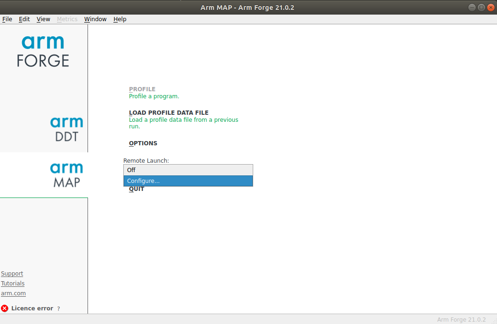
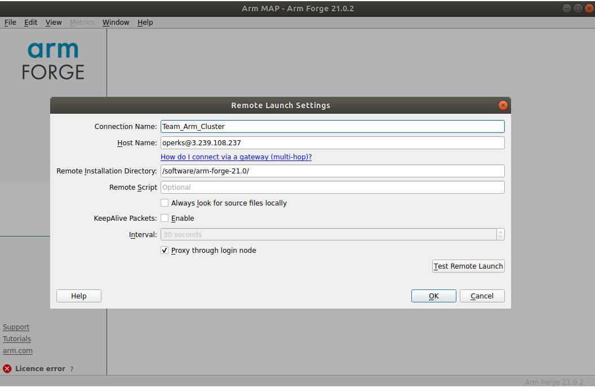
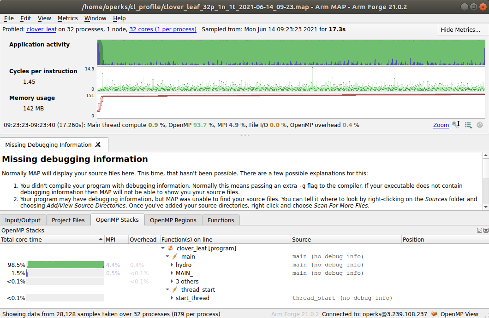
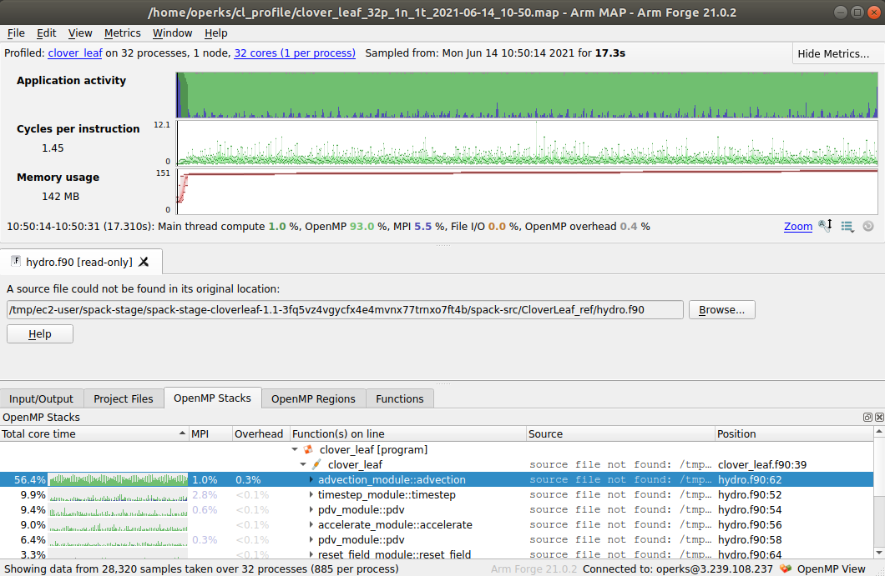

# Profiling Applications

## Arm Forge (MAP)

For this workshop we have made the [Arm Forge](https://developer.arm.com/tools-and-software/server-and-hpc/debug-and-profile/arm-forge) suite available.
Arm Forge is a cross platform profiling (MAP) and debugging (DDT) suite for HPC codes.

MAP is an ideal tool for generating application hot-spot profiles, which can help guide performance tuning.


### Generating a Profile

For this example we are going to be running MAP in profile mode, this means we are going to drive it via the CLI, rather than the GUI.

MAP can be used with `mpirun` directly and as a wrapper to `srun` (as we will do in this demo).

Let us take the `CloverLeaf` example already used, and to keep things simple we will be doing this without ReFrame for now (that comes later).
In this case we are just going to take a default build, and run the `BM16_short` benchmark on 32 cores, without OpenMP parallelism.

```
# Build Application
spack install cloverleaf@1.1%arm@21.0.0.879

# Load Environment
spack load cloverleaf@1.1%arm@21.0.0.879
spack load arm-forge@21.0

# Establish Test Case
mkdir cl_profile
cd cl_profile
wget -O clover.in https://raw.githubusercontent.com/UK-MAC/CloverLeaf_ref/master/InputDecks/clover_bm16_short.in

# Profile Code
export OMP_NUM_THREADS=1
map --profile srun -N 1 -n 32 clover_leaf
```

If successful this will have generated us a `.map` file, in our execution folder. 
In my case `clover_leaf_32p_1n_1t_2021-06-14_09-23.map`.


### Viewing a MAP Profile

Once we have a profile, we obviously want to view it, however there are a few steps we must undertake first.

#### Installing MAP Locally

Our MAP profile (`clover_leaf_32p_1n_1t_2021-06-14_09-23.map`) exists on our cluster, in the cloud.
So what we first need to do is install a local version of Forge on our Laptop/Desktop to connect to this.

The [Forge Download Page](https://developer.arm.com/tools-and-software/server-and-hpc/downloads/arm-forge) has installers for all architectures and operating systems, so download the relevant one for your local system, and follow the install instructions.

**Note:** We are only using this in client mode so you will not need a license.

Once installed please run the `map` command or the executable link to launch the GUI.

#### Configuring a Remote Launch

When we launch MAP for the first time we need to configure the `Remote Launch` settings, this tells MAP how to connect to our cluster.



Now we can Add a new configuration, by specifying the specifics of the cluster.

* **Connection Name:** Anything you want
* **Host Name:** \<Cluster user name\>@\<cluster IP address\>
* **Remote Install Dir:** `/software/arm-forge-21.0/`

**Note:** We are assuming that you have your private ssh key installed on your local machine you are connecting from.



Once configured we can press OK to proceed.

We can then connect through this `Remote Launch` configuration, by selecting our `Connection Name` from the dropdown list.

#### Open our Profile


Once we have done this we are ready to `Load Profile Data File`.
This will open a file selection window, this window is showing files currently on the cluster.

Specifically the file we are after is located in `~/cl_profile/` - so we simply navigate to that folder, and select the listed `*.map` file.

The GUI should now greet you with something similar to this:



Great we have our MAP file open, and we can see what the code has done.

However, there is one glaring issue - we are missing the debug information.

### Profiling with Debug Information

When we built our [CloverLeaf application](../../Tutorials/CloverLeaf) we had set the compile flags like so:

```
targets.append('FLAGS_ARM=-O3 -mcpu=native -funroll-loops')
targets.append('CFLAGS_ARM=-O3 -mcpu=native')
```

Here we are missing the flag to generate debug symbold `-g`, so lets modify the package.

```
spack edit cloverleaf
```

```
targets.append('FLAGS_ARM=-g -O3 -mcpu=native -funroll-loops')
targets.append('CFLAGS_ARM=-g -O3 -mcpu=native')
```

Now we want to reinstall CloverLeaf:
```
spack install --overwrite cloverleaf@1.1%arm@21.0.0.879
```
We will need to respond `y` when prompted to overwrite the previous install.

Once that is finished we can run our profiler again, with the same commands:
```
export OMP_NUM_THREADS=1
map --profile srun -N 1 -n 32 clover_leaf
```

Now if we view the generated MAP file this time:



Great, we now have a MAP profile with debug symbols. 
This allows us to see the proper function names of the hot-spot routines.
However, there is still another issue - no source code.
This makes it very hard to do more in-depth profiling.

The explanation for this lack if source code is that by default SPACK will delete the source folder as part of clearing up the staged install.
We can control this behaviour as part of the install commands.

**Option 1:** Keep stage directory
The `--keep-stage` flag will tell Spack to not delete any stage files, including the source.
```
spack install --overwrite --keep-stage cloverleaf@1.1%arm@21.0.0.879
```
This will mean that the original source files are kept inplace, this will allow MAP to find them automatically.
However, keeping a lot of staged directories is wasteful of space, and very untidy.

**Option2:** Install source files
The `--source` flag will tell Spack to install the application's source files when it is done, and then clean up the stage directory by default.

With this option you will have to use the `Browse` option in MAP to find the location of the files.
To get this new install location we can run:
```
spack location -i cloverleaf@1.1%arm@21.0.0.879
```
This gives us the root of the install location, and we must navigate from there to our specific file.


### Automating with ReFrame

In the previous section we ran our CloverLeaf example with srun directly.

One additional automation step we can take is to ask ReFrame to profile our application with MAP, and return us the MAP file.

Following the [Modifying the Parallel Launcher](https://reframe-hpc.readthedocs.io/en/stable/tutorial_advanced.html?#modifying-the-parallel-launcher-command) tutorial on the ReFrame docs site, we can come up with something that looks like this:

```
    @rfm.run_before('run')
    def set_profiler(self):
       # Establish the output filename and 'keep' it
       self.proffile = 'profile.map'
       self.keep_files.append(self.proffile)

       # Load the Forge module
       self.modules.append('arm-forge@21.0')

       # Modify the launcher
       self.job.launcher = LauncherWrapper(self.job.launcher, 'map',
                    ['--profile', '--outfile='+self.proffile])
```

We present this in a full example in our [example profiling benchmark](cloverleaf_bm16_short_profile.py).
However, once run this additional section will tell ReFrame to wrap the launcher (`srun` in our case) and replace it with:
```
map --profile --outfile=profile.map
```
It will then stage back the `profile.map` file, allowing you to view the file the normal way.