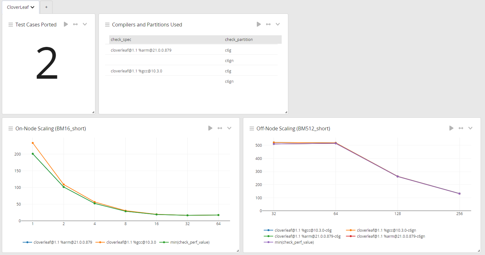

# Tutorials

## How to play

Upon being assigned a code, teams should fork this github repo.

They can then navigate to the corresponding `Application` directory.
Here they will find an existing `README.md` template file.
As teams work on a code, they should up date this file with thier commands and results.

To build and run a code teams will be asked to use Spack and ReFrame.

## Spack

## ReFrame

## GrayLog

To visualise the progress of teams we will be using dynamic dashboards in GrayLog to plot progress.

